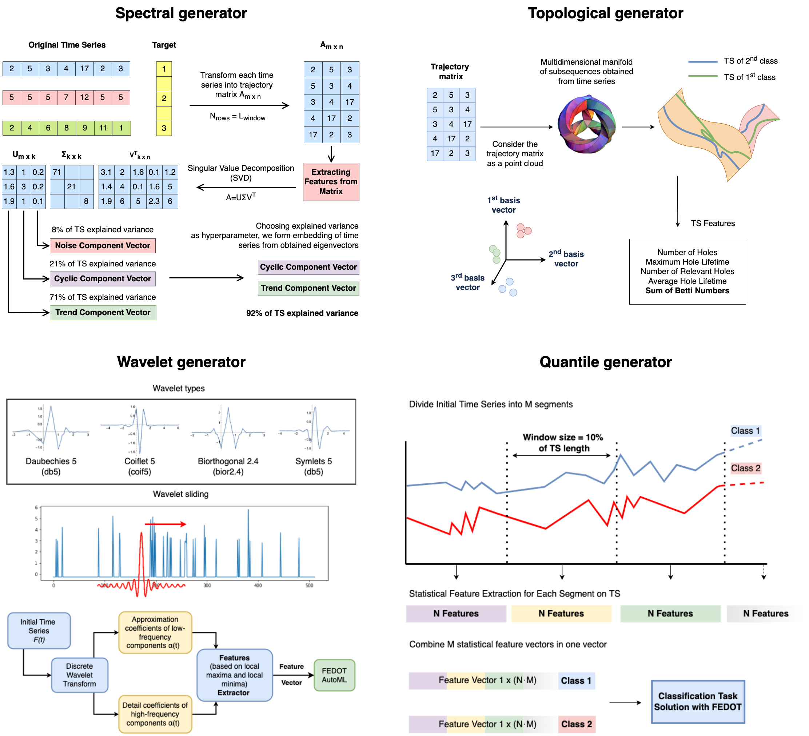

[](https://github.com/ITMO-NSS-team/Fedot.Industrial/issues) 
[](https://github.com/ITMO-NSS-team/Fedot.Industrial/stargazers) 

[](https://github.com/ITMO-NSS-team/Fedot.Industrial/blob/main/LICENSE.md)


Instead of using complex and resource-demanding deep learning techniques, which could be considered state-of-the-art
solutions, we propose using a combination of feature extractors with an ensemble of lightweight models obtained by the
algorithmic kernel of [**AutoML framework FEDOT.**](https://github.com/nccr-itmo/FEDOT)

Application field of the framework is the following:

- **Classification (time series or image)**

For this purpose we introduce four feature
generators:



After feature generation process apply evolutionary
algorithm of FEDOT to find the best model for classification task.

- **Anomaly detection (time series or image)**

*--work in progress--*

- **Change point detection (only time series)**

*--work in progress--*

- **Object detection (only image)**

*--work in progress--*

## Usage

FEDOT.Industrial provides a high-level API that allows you
to use its capabilities in a simple way.

#### Classification

To conduct time series classification you need to first
set experiment configuration using file `cases/config/Config_Classification.yaml`
and then run `cases/classification_experiment.py` script, or create your own
with the following code:

```python
from core.api.tsc_API import Industrial


if __name__ == '__main__':
    config_name = 'Config_Classification.yaml'
    ExperimentHelper = Industrial()
    ExperimentHelper.run_experiment(config_name)
```

Config file contains the following parameters:

- `feature_generators` - list of feature generators to use in the experiment
- `datasets_list` - list of datasets to use in the experiment
- `launches` - number of launches for each dataset
- `feature_generator_params` - specification for feature generators
- `fedot_params` - specification for FEDOT algorithmic kernel
- `error_correction` - flag for application of error correction model in the experiment
- `n_ecm_cycles` - number of cycles for error correction model

Datasets for classification should be stored in the `data` directory and
divided into `train` and `test` sets with `.tsv` extension. So the name of folder
in the `data` directory should be equal to the name of dataset that you want
to use in the experiment. In case of data absence in the local folder, implemented `DataLoader` 
class will try to load data from the [**UCR archive**](https://www.cs.ucr.edu/~eamonn/time_series_data/)
from **http://www.timeseriesclassification.com/dataset.php**.

Possible feature generators which could be specified in configuration are
`window_quantile`, `quantile`, `spectral_window`, `spectral`,
`wavelet` and `topological`.

There is also a possibility to ensemble several feature generators. 
It could be done by the following instruction in
`feature_generator` field of `Config_Classification.yaml` file where
you need to specify the list of feature generators:

    'ensemble: topological wavelet window_quantile quantile spectral spectral_window'

Results of experiment which include generated features, predicted classes, metrics and
pipelines are stored in `results_of_experiments/{feature_generator name}` directory.
Logs of experiment are stored in `log` directory.

#### Error correction model

It is up to you to decide whether to use error correction model or not. To apply it the `error_correction` 
flag in the `Config_Classification.yaml` file should be set to `True` and number of
cycles `n_ecm_cycles` should be provided. 
In this case after each launch of FEDOT algorithmic kernel the error correction model will be trained on the
produced error. 


The error correction model is a linear regression model of
three stages: at every next stage the model learn the error of 
prediction. The type of ensemble model for error correction is dependent 
on the number of classes:
- For `binary classification` the ensemble is also
linear regression, trained on predictions of correction stages. 
- For `multiclass classification` the ensemble is a sum of previous predictions.

#### Feature caching 
If `use_cache` bool flag in `Config.yaml` is `True`, then every feature space generated during experiment is 
cached into corresponding folder. To do so a hash from function `get_features` arguments and generator attributes 
is obtained. Then resulting feature space is dumped via `pickle` library.

The next time when the same feature space is requested, the hash is calculated again and the corresponding 
feature space is loaded from the cache which is much faster than generating it from scratch.

#### Anomaly detection
*--work in progress--*

#### Change point detection
*--work in progress--*

#### Object detection

*--work in progress--*

## Examples & Tutorials

Comprehensive tutorial will be available soon.
## Publications about FEDOT.Industrial

Our plan for publication activity is to publish papers related to
framework's usability and its applications.

First article `AUTOMATED MACHINE LEARNING APPROACH FOR TIME SERIES
CLASSIFICATION PIPELINES USING EVOLUTIONARY OPTIMISATION` by Ilya E. Revin,
Vadim A. Potemkin, Nikita R. Balabanov, Nikolay O. Nikitin is under review.

Second article `AUTOMATED ROCKBURST FORECASTING USING COMPOSITE MODELLING FOR SEISMIC SENSORS DATA`
by Ilya E. Revin, Vadim A. Potemkin, and Nikolay O. Nikitin is under review.

Stay tuned!

## Project structure

The latest stable release of FEDOT.Industrial is on the [**main
branch**](<https://github.com/ITMO-NSS-team/Fedot.Industrial>).

The repository includes the following directories:

- Package `core` contains the main classes and scripts
- Package `cases` includes several how-to-use-cases where you can start to discover how framework works
- All unit and integration tests will be observed in the `test` directory
- The sources of the documentation are in the `docs`

## Current R&D and future plans

- [x] Implement feature space caching for feature generators
- [ ] Development of meta-knowledge storage for data obtained from the experiments
- [ ] Research on time series clusterization

## Documentation

Comprehensive documentation is available [**here**](<https://fedotindustrial.readthedocs.io>).

## Supported by

The study is supported by Research Center
[**Strong Artificial Intelligence in Industry**](<https://sai.itmo.ru/>)
of [**ITMO University**](https://itmo.ru) (Saint Petersburg, Russia)

## Citation

Here will be provided a list of citations for the project.

So far you can use citation for this repository:

    @online{fedot_industrial,
      author = {Revin, Ilya and Potemkin, Vadim and Balabanov, Nikita and Nikitin, Nikolay},
      title = {FEDOT.Industrial - Framework for automated time series analysis},
      year = 2022,
      url = {https://github.com/ITMO-NSS-team/Fedot.Industrial},
      urldate = {2022-05-05}
    }
