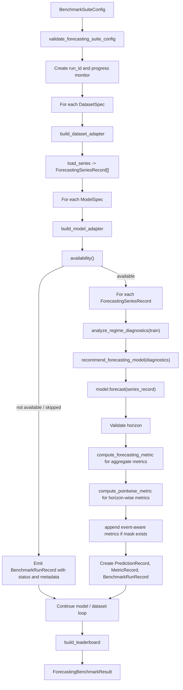

# Forecasting Suite Workflow

## Purpose

This document explains the operational workflow
of [`run_forecasting_suite(...)`](D:/data_old/WORK/Repo/Industiral/IndustrialTS/benchmark/v2/forecasting.py) and the two
new regime-aware helpers:

- [`analyze_regime_diagnostics(...)`](D:/data_old/WORK/Repo/Industiral/IndustrialTS/fedot_ind/core/models/ts_forecasting/regime_diagnostics.py)
- [`recommend_forecasting_model(...)`](D:/data_old/WORK/Repo/Industiral/IndustrialTS/fedot_ind/core/models/ts_forecasting/regime_routing.py)

The goal is to give external contributors a compact mental model of the forecasting benchmark runtime, the main
extension points, and the data contracts that flow through the system.

## Table of Contents

1. [Entry Point](#entry-point)
2. [High-Level Workflow](#high-level-workflow)
3. [Stage-by-Stage Breakdown](#stage-by-stage-breakdown)
4. [Core Runtime Objects](#core-runtime-objects)
5. [Diagnostics and Routing](#diagnostics-and-routing)
6. [Metrics and Records](#metrics-and-records)
7. [Failure and Optional-Model Paths](#failure-and-optional-model-paths)
8. [Developer Hints](#developer-hints)
9. [Common Pitfalls](#common-pitfalls)

## Entry Point

Primary runtime entry point:

- [`run_forecasting_suite(...)`](D:/data_old/WORK/Repo/Industiral/IndustrialTS/benchmark/v2/forecasting.py)

Typical orchestration wrapper:

- [`run_forecasting_benchmark_suite(...)`](D:/data_old/WORK/Repo/Industiral/IndustrialTS/benchmark/v2/api.py)

Important supporting modules:

- dataset/model contracts: [`core.py`](D:/data_old/WORK/Repo/Industiral/IndustrialTS/benchmark/v2/core.py)
- publication artifacts: [`analytics.py`](D:/data_old/WORK/Repo/Industiral/IndustrialTS/benchmark/v2/analytics.py)
- progress logging: [`progress.py`](D:/data_old/WORK/Repo/Industiral/IndustrialTS/benchmark/v2/progress.py)
- presets and local runs: [`presets.py`](D:/data_old/WORK/Repo/Industiral/IndustrialTS/benchmark/v2/presets.py)

## High-Level Workflow

## Stage-by-Stage Breakdown

### 1. Config validation

`run_forecasting_suite(...)` starts by validating the benchmark configuration.

Responsibilities:

- ensure `task_type == forecasting`
- ensure datasets and models are present
- ensure only supported metrics are requested

Why this matters:

- keeps adapter/model failures separate from configuration failures
- makes benchmark runs deterministic and reviewable

### 2. Runtime containers and progress monitor

The function initializes:

- `run_id`
- `series_records`
- `run_records`
- `prediction_records`
- `metric_records`
- `BenchmarkProgressMonitor`

This stage does not perform forecasting yet. It prepares the shell that will collect the benchmark state.

### 3. Dataset loop

For each [`DatasetSpec`](D:/data_old/WORK/Repo/Industiral/IndustrialTS/benchmark/v2/core.py):

1. `build_dataset_adapter(dataset_spec)` selects the appropriate adapter.
2. `dataset_adapter.load_series(dataset_spec)` returns a tuple
   of [`ForecastingSeriesRecord`](D:/data_old/WORK/Repo/Industiral/IndustrialTS/benchmark/v2/core.py).
3. The progress monitor is updated with dataset-level counts.

Typical adapters:

- `M4Adapter`
- `MonashAdapter`
- `InMemoryForecastingAdapter`

Each adapter is responsible for:

- reading raw source data
- producing clean `train_values` / `test_values`
- preserving split provenance in metadata

### 4. Model loop

For each [`ModelSpec`](D:/data_old/WORK/Repo/Industiral/IndustrialTS/benchmark/v2/core.py):

1. `build_model_adapter(model_spec)` constructs the runtime adapter.
2. `model.availability()` decides whether the model is executable in the current environment.

Two branches are possible:

- `RunStatus.SUCCESS`: proceed to actual forecasting
- `RunStatus.SKIPPED` / `RunStatus.NOT_AVAILABLE`: emit run records without forecasting

This separation is important for optional heavy models such as external deep baselines.

### 5. Series loop

For each [`ForecastingSeriesRecord`](D:/data_old/WORK/Repo/Industiral/IndustrialTS/benchmark/v2/core.py):

1. `analyze_regime_diagnostics(train_values)` computes structural diagnostics.
2. `recommend_forecasting_model(diagnostics)` produces an explainable routing suggestion.
3. `model.forecast(series_record)` produces forecast values and model metadata.
4. The forecast horizon is validated against `test_values`.
5. Aggregate and pointwise metrics are computed.
6. Event-aware metrics are appended when the model returns a forcing mask.
7. Prediction, metric, and run records are persisted in memory.

### 6. Result aggregation

After all dataset/model/series loops finish:

- `build_leaderboard(...)` aggregates successful run records by benchmark, dataset, and model
- the function
  returns [`ForecastingBenchmarkResult`](D:/data_old/WORK/Repo/Industiral/IndustrialTS/benchmark/v2/core.py)

`run_forecasting_benchmark_suite(...)` can then build publication artifacts and issue reports on top of this result
bundle.

## Core Runtime Objects

### `ForecastingSeriesRecord`

Represents one benchmarked time series with a fixed train/test split.

Key fields:

- benchmark
- dataset_name
- subset
- series_id
- frequency
- forecast_horizon
- seasonal_period
- train_values
- test_values
- metadata

### `BenchmarkRunRecord`

Represents one model run on one series.

Key fields:

- status
- metrics_summary
- message
- tags
- metadata

Important metadata payloads currently present in forecasting runs:

- `regime_diagnostics`
- `routing_recommendation`
- model-specific metadata such as:
    - OKHS diagnostics
    - HAVOK forcing mask
    - active/calm interval counts

### `MetricRecord`

Stores either aggregate or horizon-wise metric values.

Distinguishing field:

- `horizon_index is None` -> aggregate metric
- `horizon_index is not None` -> per-horizon metric

### `PredictionRecord`

Stores one forecast value per horizon step.

## Diagnostics and Routing

### `analyze_regime_diagnostics(...)`

This function converts a raw train series into a typed structural summary.

Computed signals:

- `series_length`
- `dominant_period`
- `acf_decay_rate`
- `spectral_concentration`
- `spectral_flatness`
- `local_linearity_score`
- `switching_score`
- `regime_hint`

Conceptually it answers:

- is the series periodic?
- does it look switching or bursty?
- is it mostly locally linear?
- is the structure weak or unstable?

### `recommend_forecasting_model(...)`

This function takes the typed diagnostics and emits a typed routing recommendation.

Current primary routes:

- periodic -> `mssa` or `ssa_compat`
- switching / event-driven -> `havok`
- locally linear -> `okhs`
- insufficient or weak structure -> `naive_last_value` / `linear_trend`

Returned object:

- `RegimeRoutingDecision`

Important fields:

- `primary_adapter`
- `candidate_adapters`
- `fallback_adapter`
- `confidence`
- `rationale`

Why this is useful:

- benchmark artifacts can explain what the system thinks the regime is
- future orchestration can turn the same recommendation into actual model selection

## Metrics and Records

The forecasting suite computes two categories of metrics.

### Aggregate metrics

Produced by `compute_forecasting_metric(...)`:

- `mae`
- `rmse`
- `smape`
- `mase`
- `owa`

### Horizon-wise metrics

Produced by `compute_pointwise_metric(...)` and stored with `horizon_index`.

### Event-aware interval metrics

Produced by `_append_event_interval_metrics(...)` when `forecast_forcing_mask` is present.

Current outputs:

- `mae_active`
- `mae_calm`
- `active_forecast_steps`
- `calm_forecast_steps`

This makes HAVOK and future event-aware models benchmarkable without changing the global result schema.

## Failure and Optional-Model Paths

### Optional / unavailable models

If `model.availability()` reports a non-success status:

- the suite still emits one `BenchmarkRunRecord` per series
- the record includes:
    - `optional`
    - `regime_diagnostics`
    - `routing_recommendation`
- no metrics or predictions are generated

### Forecast execution errors

Two failure channels exist:

- `ModelExecutionError`: expected benchmark/runtime failure with explicit status
- generic `Exception`: unexpected failure, converted to `RunStatus.FAILED`

In both cases the suite preserves diagnostics metadata, which is important for post-mortem debugging.

## Developer Hints

### If you add a new dataset adapter

Make sure it returns valid `ForecastingSeriesRecord` objects and preserves split provenance in metadata.

### If you add a new model adapter

The adapter should return:

- forecast array with the correct horizon
- typed or plain-JSON-compatible metadata
- availability status for optional environments

### If you add new diagnostics

Prefer adding them as typed records first, then serialize via `.to_dict()` into benchmark metadata.

### If you add new routing rules

Keep three layers separate:

- measurement: `analyze_regime_diagnostics(...)`
- recommendation: `recommend_forecasting_model(...)`
- execution: the actual selected model adapter

This separation is what keeps the system reviewable.

### If you extend artifacts

Do not change the core result schema unless necessary. Prefer adding new metadata fields or publication-layer views.

## Common Pitfalls

### 1. Confusing diagnostics with execution

`routing_recommendation` is currently advisory metadata, not a forced execution path.

### 2. Losing split provenance

Adapters must preserve how the train/test split was produced. Without this, benchmark comparisons become hard to trust.

### 3. Returning the wrong forecast shape

`model.forecast(...)` must match the target horizon exactly. Otherwise `run_forecasting_suite(...)` will emit a failed
record.

### 4. Mixing aggregate and pointwise metrics

Keep aggregate leaderboard metrics separate from horizon-wise diagnostics.

### 5. Hiding optional dependency failures

Optional models should surface `skipped` / `not_available` explicitly instead of failing silently.

## Recommended Contributor Reading Order

1. [`benchmark/v2/core.py`](D:/data_old/WORK/Repo/Industiral/IndustrialTS/benchmark/v2/core.py)
2. [`benchmark/v2/forecasting.py`](D:/data_old/WORK/Repo/Industiral/IndustrialTS/benchmark/v2/forecasting.py)
3. [`fedot_ind/core/models/ts_forecasting/regime_diagnostics.py`](D:/data_old/WORK/Repo/Industiral/IndustrialTS/fedot_ind/core/models/ts_forecasting/regime_diagnostics.py)
4. [`fedot_ind/core/models/ts_forecasting/regime_routing.py`](D:/data_old/WORK/Repo/Industiral/IndustrialTS/fedot_ind/core/models/ts_forecasting/regime_routing.py)
5. [`benchmark/v2/analytics.py`](D:/data_old/WORK/Repo/Industiral/IndustrialTS/benchmark/v2/analytics.py)
