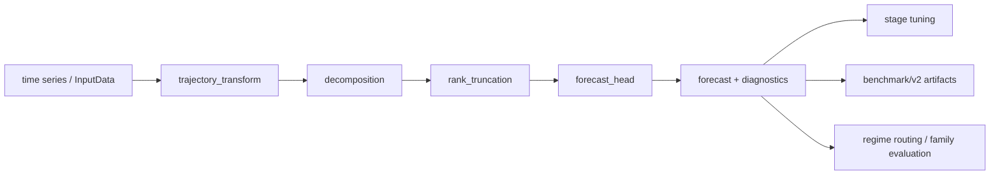
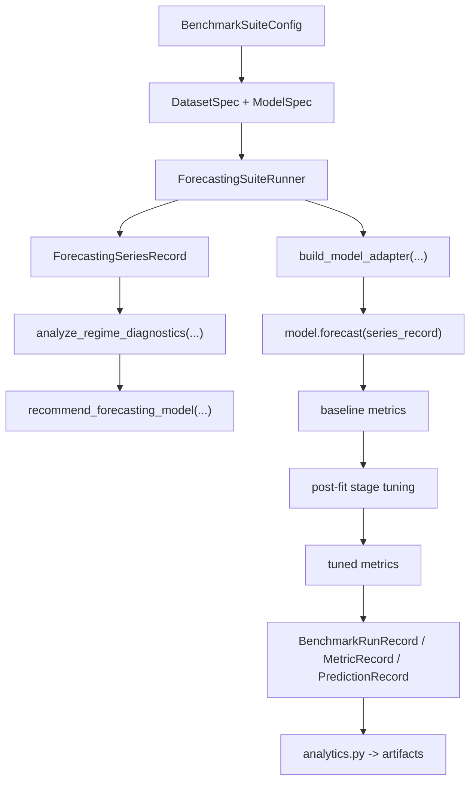

# Onboarding Guide Для Forecasting-Разработчиков В `Fedot.Industrial`

## Оглавление

- [1. Назначение документа](#1-назначение-документа)
- [2. Архитектурный снимок forecasting stack](#2-архитектурный-снимок-forecasting-stack)
- [3. Карта forecasting-пакетов](#3-карта-forecasting-пакетов)
- [4. Схема model families](#4-схема-model-families)
- [5. Базовые runtime contracts](#5-базовые-runtime-contracts)
- [6. Stage-tuning contracts](#6-stage-tuning-contracts)
- [7. Benchmark и evaluation contracts](#7-benchmark-и-evaluation-contracts)
- [8. Как проходит один forecasting run](#8-как-проходит-один-forecasting-run)
- [9. Как читать код по семействам моделей](#9-как-читать-код-по-семействам-моделей)
- [10. Как добавить новую forecasting-модель](#10-как-добавить-новую-forecasting-модель)
- [11. Как дебажить forecasting stack](#11-как-дебажить-forecasting-stack)
- [12. Частые ловушки](#12-частые-ловушки)
- [13. Рекомендуемый маршрут чтения для нового разработчика](#13-рекомендуемый-маршрут-чтения-для-нового-разработчика)

## 1. Назначение документа

Этот документ нужен разработчику, который заходит именно в forecasting-часть `Fedot.Industrial`.

Его цель:

- дать **быструю карту forecasting stack**;
- объяснить, как устроены текущие **model families**;
- зафиксировать **runtime contracts**, на которых сейчас держится forecasting runtime;
- показать, как forecasting связан с `benchmark/v2`;
- дать практический порядок действий при добавлении, рефакторинге или отладке forecasting-модели.

Это не roadmap и не PR plan. Это именно **рабочий onboarding guide**.

Для общего engineering-контекста лучше читать вместе с:

- [industrial_development_guide.md](./industrial_development_guide.md)
- [radical_forecasting_refactor_plan.md](./radical_forecasting_refactor_plan.md)
- [forecasting_phase_2_roadmap.md](./forecasting_phase_2_roadmap.md)
- [forecasting_suite_workflow.md](../benchmark_v2/forecasting_suite_workflow.md)
- [forecasting_developer_architecture.md](./forecasting_developer_architecture.md)

## 2. Архитектурный снимок forecasting stack

Текущая целевая модель forecasting stack в Industrial такая:

Главная идея:

- forecasting больше не должен мыслиться как один большой monolithic forecaster;
- даже если модель оформлена как shell-класс, внутри неё желательно видеть stage decomposition:
    - trajectory transform
    - decomposition
    - rank truncation
    - forecast head

Практическое следствие:

- если модель сложно описать в терминах stages, значит она пока ещё architectural outlier;
- если tuning, benchmark и diagnostics живут в других понятиях, чем runtime, значит стек ещё не до конца выровнен.

## 3. Карта forecasting-пакетов

Текущая структура [`ts_forecasting`](../../fedot_ind/core/models/ts_forecasting/__init__.py):

| Пакет             | Что там находится                            | Для чего заходить                       |
|-------------------|----------------------------------------------|-----------------------------------------|
| `lagged_model`    | lagged/low-rank/page/topological модели      | базовые и low-rank forecasting families |
| `dmd_models`      | HAVOK, OKHS/fDMD и близкие operator-models   | operator-style forecasting              |
| `ensemble_models` | hybrid/composite модели                      | branch-based forecasting и aggregation  |
| `neural_models`   | neural heads и bridge/runtime слой           | neural forecasting contracts            |
| `forecast_tuning` | stage tuning plan, execution, runtime bridge | tuning orchestration                    |
| `regime_utils`    | diagnostics и routing                        | explainability, family routing          |
| `lagged_strategy` | legacy compatibility entrypoints             | backward compatibility и старые imports |

Содержимое по файлам сейчас выглядит так:

### `lagged_model`

- [lagged_ridge_forecaster.py](../../fedot_ind/core/models/ts_forecasting/lagged_model/lagged_ridge_forecaster.py)
- [low_rank_lagged_ridge_forecaster.py](../../fedot_ind/core/models/ts_forecasting/lagged_model/low_rank_lagged_ridge_forecaster.py)
- [mssa_forecaster.py](../../fedot_ind/core/models/ts_forecasting/lagged_model/mssa_forecaster.py)
- [ssa_forecaster.py](../../fedot_ind/core/models/ts_forecasting/lagged_model/ssa_forecaster.py)
- [topo_forecaster.py](../../fedot_ind/core/models/ts_forecasting/lagged_model/topo_forecaster.py)

### `dmd_models`

- [havok_forecaster.py](../../fedot_ind/core/models/ts_forecasting/dmd_models/havok_forecaster.py)
- [okhs_fdmd_forecaster.py](../../fedot_ind/core/models/ts_forecasting/dmd_models/okhs_fdmd_forecaster.py)

### `neural_models`

- [neural_forecast_head.py](../../fedot_ind/core/models/ts_forecasting/neural_models/neural_forecast_head.py)
- [neural_forecast_head_bridge.py](../../fedot_ind/core/models/ts_forecasting/neural_models/neural_forecast_head_bridge.py)

### `ensemble_models`

- [hybrid_ensemble_forecaster.py](../../fedot_ind/core/models/ts_forecasting/ensemble_models/hybrid_ensemble_forecaster.py)

### `forecast_tuning`

- [stage_tuning.py](../../fedot_ind/core/models/ts_forecasting/forecast_tuning/stage_tuning.py)
- [stage_tuning_execution.py](../../fedot_ind/core/models/ts_forecasting/forecast_tuning/stage_tuning_execution.py)
- [stage_tuning_runtime.py](../../fedot_ind/core/models/ts_forecasting/forecast_tuning/stage_tuning_runtime.py)

### `regime_utils`

- [regime_diagnostics.py](../../fedot_ind/core/models/ts_forecasting/regime_utils/regime_diagnostics.py)
- [regime_routing.py](../../fedot_ind/core/models/ts_forecasting/regime_utils/regime_routing.py)

## 4. Схема model families

### 4.1. Canonical stage-native models

Source of truth сейчас находится в [forecasting_registry.py](../../fedot_ind/core/repository/forecasting_registry.py).

Текущий canonical набор:

- `lagged_ridge_forecaster`
- `topo_forecaster`
- `low_rank_lagged_ridge_forecaster`
- `ssa_forecaster`
- `mssa_forecaster`
- `havok_forecaster`
- `okhs_fdmd_forecaster`
- `hybrid_ensemble_forecaster`

Актуальные aliases:

- `mssa -> mssa_forecaster`
- `havok -> havok_forecaster`

### 4.2. Семейства моделей

| Family              | Модели                                                                                            | Идея                                    |
|---------------------|---------------------------------------------------------------------------------------------------|-----------------------------------------|
| `lagged_linear`     | `lagged_forecaster`, `lagged_ridge_forecaster`, `topo_forecaster`                                 | lagged-like linear baselines            |
| `low_rank_linear`   | `low_rank_lagged_ridge_forecaster`, `ssa_forecaster`, `mssa_forecaster`                           | low-rank/page/hankel linear forecasting |
| `operator_model`    | `havok_forecaster`, `okhs`, `okhs_fdmd_forecaster`, `hybrid_ensemble_forecaster`, `classical_dmd` | operator-style or hybrid complex models |
| `neural_forecaster` | `patch_tst_model`, `tcn_model`, `deepar_model`, `nbeats_model`, `tft`                             | neural forecasting heads                |
| `simple_baseline`   | `naive_last_value`, `linear_trend`, etc.                                                          | простые fallback baselines              |

Family mapping централизован
в [regime_routing.py](../../fedot_ind/core/models/ts_forecasting/regime_utils/regime_routing.py)
через `adapter_name_to_family(...)`.

### 4.3. Подробная схема по моделям

| Модель                                                            | Основной runtime смысл                       | Типичный stage graph                                                     |
|-------------------------------------------------------------------|----------------------------------------------|--------------------------------------------------------------------------|
| `lagged_ridge_forecaster`                                         | canonical lagged baseline                    | `hankelisation -> ridge_head`                                            |
| `topo_forecaster`                                                 | lagged baseline на топологических признаках  | `hankelisation -> topological_features -> ridge_head`                    |
| `low_rank_lagged_ridge_forecaster`                                | low-rank lagged baseline                     | `hankelisation -> decomposition -> rank_truncation -> ridge_head`        |
| `ssa_forecaster`                                                  | compatibility wrapper над page/low-rank path | `page_embedding -> decomposition -> rank -> head`                        |
| `mssa_forecaster`                                                 | multivariate SSA-style path                  | `page_embedding -> decomposition -> rank -> head`                        |
| `havok_forecaster`                                                | switching/operator forecasting               | `hankelisation -> svd -> state/forcing head`                             |
| `okhs_fdmd_forecaster`                                            | OKHS/fDMD shell-first path                   | `trajectory -> representation/decomposition -> rank policy -> fdmd head` |
| `hybrid_ensemble_forecaster`                                      | composite model                              | `branch A + branch B + branch C -> weighted aggregation`                 |
| `patch_tst_model` / `tcn_model` / `deepar_model` / `nbeats_model` | neural heads                                 | neural head path with stage-aware wrapper/bridge                         |

## 5. Базовые runtime contracts

Главный source-of-truth:

- [forecasting_runtime.py](../../fedot_ind/core/models/ts_forecasting/forecasting_runtime.py)

### 5.1. `TensorDevicePolicy`

Назначение:

- единая политика выбора `device` и `dtype`;
- canonical internal behavior: `auto -> cuda if available else cpu`.

Почему это важно:

- device policy не должна тюниться как обычный hyperparameter;
- runtime и benchmark должны одинаково понимать, где и как создаются тензоры.

### 5.2. `ForecastTensorBatch`

Это основной internal payload forecasting runtime.

Содержит:

- `history`
- `target`
- `forecast_horizon`
- `idx`
- `metadata`

Смысл:

- не работать глубоко внутри runtime с сырыми `np.ndarray` и разрозненными полями;
- держать единый transport object для tensor-native forecasting path.

### 5.3. `ForecastingSplitSpec`

Задаёт правила разбиения временного ряда.

Поддерживаемые split kinds:

- `holdout`
- `time_series_split`
- `expanding_window`
- `rolling_window`
- `rolling_origin`
- `blocked`

Практический смысл:

- stage tuning и runtime evaluation не должны жить на одном ad hoc holdout;
- split semantics теперь является typed contract, а не спрятанной логикой.

### 5.4. `ForecastingFoldSplit`

Описывает один fold:

- train batch
- validation target
- индексы train/test
- fold metadata

Это важный debugging объект: если tuning ведёт себя странно, смотреть нужно именно на fold construction.

### 5.5. `ForecastingEvaluationResult`

Возвращает:

- `metric_name`
- `metric_value`
- `per_horizon_metrics`
- `metadata`

Этот объект нужен, чтобы:

- baseline и tuned evaluation сравнивались одинаково;
- benchmark и tuning говорили на одном metric contract.

### 5.6. Stage results

Основные stage-level results:

- `TrajectoryTransformResult`
- `DecompositionResult`
- `RankTruncationResult`
- `ForecastHeadResult`

Их смысл:

- превращать промежуточные стадии forecasting path в serializable, testable contracts;
- не держать stage metadata только в голове разработчика или в случайных dict-полях.

### 5.7. Boundary adapters

Важные boundary classes:

- `ForecastingBoundaryAdapter`
- `ForecastingRuntimeAdapter`

Роль:

- на границе с FEDOT можно иметь `InputData/OutputData`;
- внутри forecasting runtime лучше работать с `ForecastTensorBatch`.

## 6. Stage-tuning contracts

Главные файлы:

- [stage_tuning.py](../../fedot_ind/core/models/ts_forecasting/forecast_tuning/stage_tuning.py)
- [stage_tuning_execution.py](../../fedot_ind/core/models/ts_forecasting/forecast_tuning/stage_tuning_execution.py)
- [stage_tuning_runtime.py](../../fedot_ind/core/models/ts_forecasting/forecast_tuning/stage_tuning_runtime.py)

### 6.1. `ForecastingStageName`

Текущее canonical stage vocabulary:

- `trajectory_transform`
- `decomposition_rank`
- `forecast_head`
- `ensemble`

### 6.2. `ForecastingStageTuningPlan`

Это machine-readable описание того:

- какие стадии есть у модели;
- какие параметры относятся к какой стадии;
- какая family у модели;
- можно ли рассчитывать на simultaneous tuning.

На практике это означает, что модель должна уметь ответить:

`Что именно тюним сначала, что потом и в каком vocabulary?`

### 6.3. `ForecastingStageSearchSpace`

Это stage-specific search-space slice.

Нужен, чтобы:

- не тюнить всю модель как один неразборчивый blob;
- знать, какие параметры реально относятся к trajectory, rank или head stage.

### 6.4. `ForecastingStageTuningExecution`

Показывает:

- какие параметры были предложены;
- какие реально применились;
- какие проигнорированы;
- во что превратился parameter state после каждой стадии.

Для дебага это очень полезный объект: если tuning “ничего не меняет”, сначала надо смотреть его.

### 6.5. `SequentialStageTuningRunner`

Это coordinator-class для sequential tuning.

Он:

- итерируется по стадиям;
- строит candidate grids;
- прогоняет objective;
- выбирает лучший вариант stage-by-stage.

Именно его стоит читать, если задача касается tuning orchestration.

### 6.6. `ForecastMetricEvaluator`

Метрики больше не должны жить как большой `if/elif` helper.

Сейчас metric evaluation выделен в отдельный evaluator-класс, который маппит имя метрики на конкретную реализацию.

### 6.7. `ForecastingSeriesEvaluator`

Это runtime evaluator на уровне одного ряда.

Он отвечает за:

- split construction;
- training/evaluation по folds;
- сбор split metadata;
- формирование итоговой оценки.

### 6.8. `ForecastingSeriesStageTuningRunner`

Это orchestration-слой уже на уровне “baseline vs tuned”.

Он:

- считает baseline evaluation;
- строит objective;
- запускает sequential stage tuning;
- считает best-params evaluation;
- собирает `ForecastingSeriesStageTuningResult`.

## 7. Benchmark и evaluation contracts

Главный слой:

- [benchmark/v2/core.py](../../benchmark/v2/core.py)

### 7.1. Конфигурационные contracts

- `DatasetSpec`
- `ModelSpec`
- `RunSpec`
- `ArtifactSpec`
- `BenchmarkSuiteConfig`

Они описывают:

- что запускаем;
- над какими данными;
- с какими метриками;
- как пишем artifacts;
- как ведём progress/verbosity.

### 7.2. Runtime records

- `ForecastingSeriesRecord`
- `PredictionRecord`
- `MetricRecord`
- `BenchmarkRunRecord`
- `ForecastingBenchmarkResult`

Это основной benchmark-facing API. Если у модели нет корректного adapter path до этих records, она ещё не является
полноценным benchmark citizen.

### 7.3. Benchmark runner

Главный orchestration файл:

- [forecasting.py](../../benchmark/v2/forecasting.py)

Ключевые coordinator classes:

- `ForecastingSuiteRunner`
- `ForecastingSeriesArtifactsRecorder`
- `ForecastingPostFitTuningCoordinator`

Хорошая mental model:

`runtime делает forecast, benchmark оформляет это в records и artifacts`

### 7.4. Policies

В benchmark/runtime сейчас уже есть централизованные policies:

- `ForecastingProgressPolicy`
- `ForecastingVerbosityPolicy`

Они нужны, чтобы:

- не размазывать logging/verbosity по нескольким слоям;
- централизованно управлять progress bars, metadata pruning и publication behavior.

## 8. Как проходит один forecasting run

Высокоуровневая схема:

Практический смысл:

- баг может сидеть в runtime model implementation;
- или в adapter construction;
- или в stage tuning runtime;
- или в benchmark recording/publication layer.

Поэтому debugging обычно идёт не “внутрь модели сразу”, а по слоям.

## 9. Как читать код по семействам моделей

### 9.1. Если задача про lagged baselines

Читать в таком порядке:

1. [lagged_ridge_forecaster.py](../../fedot_ind/core/models/ts_forecasting/lagged_model/lagged_ridge_forecaster.py)
2. [low_rank_lagged_ridge_forecaster.py](../../fedot_ind/core/models/ts_forecasting/lagged_model/low_rank_lagged_ridge_forecaster.py)
3. [topo_forecaster.py](../../fedot_ind/core/models/ts_forecasting/lagged_model/topo_forecaster.py)
4. [stage_tuning.py](../../fedot_ind/core/models/ts_forecasting/forecast_tuning/stage_tuning.py)

### 9.2. Если задача про SSA/MSSA

Читать:

1. [mssa_forecaster.py](../../fedot_ind/core/models/ts_forecasting/lagged_model/mssa_forecaster.py)
2. [ssa_forecaster.py](../../fedot_ind/core/models/ts_forecasting/lagged_model/ssa_forecaster.py)
3. [forecasting_runtime.py](../../fedot_ind/core/models/ts_forecasting/forecasting_runtime.py)

### 9.3. Если задача про operator models

Читать:

1. [havok_forecaster.py](../../fedot_ind/core/models/ts_forecasting/dmd_models/havok_forecaster.py)
2. [okhs_fdmd_forecaster.py](../../fedot_ind/core/models/ts_forecasting/dmd_models/okhs_fdmd_forecaster.py)
3. [okhs_runtime.py](../../fedot_ind/core/models/kernel/okhs_runtime.py)
4. [regime_routing.py](../../fedot_ind/core/models/ts_forecasting/regime_utils/regime_routing.py)

### 9.4. Если задача про neural forecasting

Читать:

1. [neural_forecast_head.py](../../fedot_ind/core/models/ts_forecasting/neural_models/neural_forecast_head.py)
2. [neural_forecast_head_bridge.py](../../fedot_ind/core/models/ts_forecasting/neural_models/neural_forecast_head_bridge.py)
3. [stage_tuning_runtime.py](../../fedot_ind/core/models/ts_forecasting/forecast_tuning/stage_tuning_runtime.py)

### 9.5. Если задача про benchmark-side bugs

Читать:

1. [core.py](../../benchmark/v2/core.py)
2. [forecasting.py](../../benchmark/v2/forecasting.py)
3. [analytics.py](../../benchmark/v2/analytics.py)
4. [verbosity.py](../../benchmark/v2/verbosity.py)

## 10. Как добавить новую forecasting-модель

Рекомендуемая последовательность:

### Шаг 1. Определить family и stage graph

Нужно явно ответить:

- это `lagged_linear`, `low_rank_linear`, `operator_model` или `neural_forecaster`;
- как выглядит её stage graph.

### Шаг 2. Определить runtime contract

Нужно понимать:

- какие входные данные принимает runtime;
- какие diagnostics и metadata должна вернуть модель;
- что будет canonical parameter set.

### Шаг 3. Добавить stage tuning contract

Новая модель должна уметь участвовать в:

- `build_forecasting_stage_tuning_plan(...)`
- `build_forecasting_stage_search_spaces(...)`
- runtime stage tuning bridge

### Шаг 4. Прописать registry/defaults/search space

Минимум:

- [forecasting_registry.py](../../fedot_ind/core/repository/forecasting_registry.py)
- [default_operation_params.json](../../fedot_ind/core/repository/data/default_operation_params.json)
- [search_space.py](../../fedot_ind/core/tuning/search_space.py)

### Шаг 5. Подключить benchmark adapter

Путь:

- [forecasting.py](../../benchmark/v2/forecasting.py)

Нужно обеспечить:

- `availability()`
- `forecast(...)`
- diagnostics metadata
- compatibility with baseline/tuned comparison

### Шаг 6. Добавить mirrored tests

Минимум:

- unit tests на runtime/helper logic;
- stage tuning tests;
- benchmark adapter regression test.

## 11. Как дебажить forecasting stack

### 11.1. Если падает import после реорганизации файлов

Проверять в таком порядке:

1. package `__init__.py`;
2. compatibility shims;
3. canonical import path в model file;
4. stage tuning/runtime imports;
5. benchmark adapter imports.

Это особенно важно после разбиения `ts_forecasting` на тематические пакеты.

### 11.2. Если модель не создаётся в benchmark

Смотреть:

1. `build_model_adapter(...)` в [forecasting.py](../../benchmark/v2/forecasting.py)
2. `ModelSpec.params`
3. constructor сигнатуру модели
4. defaults/search space drift

### 11.3. Если tuning ведёт себя странно

Смотреть:

1. `ForecastingStageTuningPlan`
2. `ForecastingStageSearchSpace`
3. `ForecastingStageTuningExecution`
4. split spec и fold metadata
5. `ForecastingSeriesStageTuningResult`

### 11.4. Если benchmark-артефакты неполные или странные

Смотреть:

1. `BenchmarkRunRecord.metadata`
2. `verbosity policy`
3. `analytics.py`
4. family mapping и stage diagnostics payload

## 12. Частые ловушки

### 12.1. Несогласованность между constructor, defaults и search space

Это одна из самых частых причин benchmark/runtime bugs.

Проверять нужно всегда вместе:

- модель;
- `default_operation_params.json`;
- `search_space.py`;
- benchmark adapter.

### 12.2. Legacy import path всё ещё живёт рядом с новым

После реорганизации пакетов это особенно опасно: часть кода может использовать новый canonical path, а часть — старый
shim.

### 12.3. Модель benchmark-compatible, но не stage-aware

Это промежуточное состояние допустимо только временно. Зрелая forecasting-модель должна быть:

- benchmark-compatible;
- stage-aware;
- tuning-aware;
- routing-aware.

### 12.4. Diagnostics есть в runtime, но не доходят до benchmark

Если модель умеет `get_diagnostics()`, это ещё не значит, что `benchmark/v2` их увидит. Нужно проверить adapter path и
serialization.

## 13. Рекомендуемый маршрут чтения для нового разработчика

### Минимальный маршрут

1. [forecasting_runtime.py](../../fedot_ind/core/models/ts_forecasting/forecasting_runtime.py)
2. [forecasting_registry.py](../../fedot_ind/core/repository/forecasting_registry.py)
3. [stage_tuning.py](../../fedot_ind/core/models/ts_forecasting/forecast_tuning/stage_tuning.py)
4. [stage_tuning_runtime.py](../../fedot_ind/core/models/ts_forecasting/forecast_tuning/stage_tuning_runtime.py)
5. [regime_routing.py](../../fedot_ind/core/models/ts_forecasting/regime_utils/regime_routing.py)
6. [benchmark/v2/forecasting.py](../../benchmark/v2/forecasting.py)

### Если хочется понять “живую” модельную архитектуру

1. [lagged_ridge_forecaster.py](../../fedot_ind/core/models/ts_forecasting/lagged_model/lagged_ridge_forecaster.py)
2. [mssa_forecaster.py](../../fedot_ind/core/models/ts_forecasting/lagged_model/mssa_forecaster.py)
3. [havok_forecaster.py](../../fedot_ind/core/models/ts_forecasting/dmd_models/havok_forecaster.py)
4. [okhs_fdmd_forecaster.py](../../fedot_ind/core/models/ts_forecasting/dmd_models/okhs_fdmd_forecaster.py)
5. [hybrid_ensemble_forecaster.py](../../fedot_ind/core/models/ts_forecasting/ensemble_models/hybrid_ensemble_forecaster.py)

### Если хочется понять benchmark flow end-to-end

1. [forecasting_suite_workflow.md](../benchmark_v2/forecasting_suite_workflow.md)
2. [core.py](../../benchmark/v2/core.py)
3. [forecasting.py](../../benchmark/v2/forecasting.py)
4. [analytics.py](../../benchmark/v2/analytics.py)

---

## Краткая итоговая формула

Forecasting-разработка в Industrial устроена хорошо тогда, когда:

- модель понятна как stage graph;
- её runtime выражен typed contracts;
- tuning знает её stage structure;
- benchmark понимает её family и diagnostics;
- а debug path можно пройти по слоям, не распутывая один гигантский monolith.

## 14. Актуализация перед публикацией forecasting-ветки

Перед ревью этой ветки новый разработчик должен читать onboarding вместе с новыми reference-документами:

- [forecasting_runtime_api_reference.md](./forecasting_runtime_api_reference.md)
- [forecasting_models_reference.md](./forecasting_models_reference.md)
- [benchmark_v2_forecasting_guide.md](./benchmark_v2_forecasting_guide.md)
- [forecasting_branch_development_history.md](./forecasting_branch_development_history.md)
- [forecasting_merge_artifact_policy.md](./forecasting_merge_artifact_policy.md)

### Куда смотреть при типовом баге

Если падает forecasting model:

- сначала проверить model family и canonical import path;
- затем открыть соответствующий подпакет `lagged_model`, `dmd_models`, `neural_models` или `ensemble_models`;
- после этого проверить `get_diagnostics()` и stage tuning hooks.

Если падает tuning:

- начать с `forecast_tuning/stage_tuning.py`;
- затем проверить `stage_tuning_execution.py`;
- после этого смотреть `stage_tuning_runtime.py` и split metadata.

Если падает benchmark run:

- начать с `benchmark/v2/forecasting.py`;
- проверить `ModelSpec.params`;
- проверить adapter constructor;
- затем смотреть `stage_tuning_report_error` или item checkpoint в `progress/items`.

Если нужно анализировать уже сохранённые результаты:

- использовать `benchmark/v2/result_visualization.py`;
- для M4 lagged debug path запускать `benchmark/v2/examples/benchmark/visualize_m4_lagged_results_240426.py`;
- для полной отрисовки всех series передавать `--max-series-plots all`.

### Что не коммитить

Не добавлять в PR:

- benchmark results;
- `progress/items`;
- visualizations;
- локальные datasets;
- checkpoint-файлы;
- архивы и тяжёлые generated artifacts.

Подробное правило зафиксировано в [forecasting_merge_artifact_policy.md](./forecasting_merge_artifact_policy.md).
