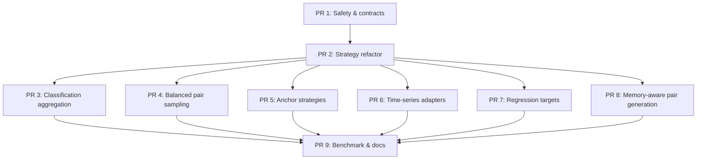

# PDL — план PR

Связанные заметки:

- [[pdl-theory-and-ideas|PDL — теория и идеи применения]]
- [[pdl-development-issues|PDL — постановка Issue по разработке]]

## Общая логика разбиения

План разбит так, чтобы сначала закрепить контракты и безопасность текущего PDL, затем вынести расширяемую архитектуру,
после этого добавлять новые научные режимы:

1. Агрегация вероятностей классов с учетом апостериорного распределения
2. Семплирование с учетом баланса классов
3. Стратегии выбора якорей
4. Создание признакового описания пар с использование генераторов признаков
5. Различные стратегии "вычисления дельт" для кейса регрессии

Основное правило:

> Каждый PR должен быть самостоятелен сам по себе, не менять публичный API без необходимости и оставлять модуль в
> рабочем состоянии.

---

## Dependency map



---

## PR 1. PDL контракты

### Цель

Зафиксировать математические соглашения текущей реализации и убрать хрупкие места, которые могут сломать последующие
изменения.

### Связанные Issue

- [[pdl-development-issues#Issue 1. Зафиксировать PDL contracts и семантику pair targets|Issue 1]]
- [[pdl-development-issues#Issue 2. Починить или удалить legacy preprocessing/transformer path|Issue 2]]

### Предлагаемое имя ветки

```text
feature/pdl-contract-hardening
```

### Изменяемые зоны

```text
fedot_ind/core/models/pdl/pairwise_core.py
fedot_ind/core/models/pdl/pairwise_model.py
fedot_ind/core/models/pdl/pairwise_transform.py
tests/unit/core/models/test_pdl.py
```

### Состав изменений

- Добавить явные constants/metadata для classification target semantics.
- Переименовать внутренние переменные так, чтобы `same` и `different` не смешивались.
- Зафиксировать regression sign convention `left - anchor`.
- Добавить `pair_target_semantics` в diagnostics.
- Починить `PDCDataTransformer` или вывести его из active path как legacy.
- Добавить недостающие imports.
- Добавить tests на deterministic toy arrays.

### Tests

```bash
pytest tests/unit/core/models/test_pdl.py
```

Новые тесты:

- `test_classification_pair_target_semantics_same_is_zero_current_contract`
- `test_regression_pair_target_is_left_minus_anchor`
- `test_predict_same_probability_uses_same_label_column`
- `test_pair_target_semantics_is_reported_in_diagnostics`
- `test_pdc_data_transformer_initializes_x_preprocessor`
- `test_pdc_data_transformer_uses_y_preprocessor_for_target`

### Критерий приемки

- Поведение default classifier/regressor не меняется.
- Функция diagnostics явно сообщает target semantics.
- Нет обращения к неинициализированным attributes в transformer path.
- Все текущие PDL unit tests проходят.

### Риски

- Возможна регрессия у кода, который неявно полагался на legacy helper semantics.
- Если transformer используется где-то вне тестов, минимальный fix безопаснее удаления.

### Рекомендация по review

Проверять не только shape tests, но и exact values на маленьких матрицах.

---

## PR 2. Рефактор стратегии PDL без смены публичного API

### Цель

Разделить роли внутри PDL-модуля и подготовить архитектуру для новых режимов без разрастания `if/else`.

### Связанные Issue

- [[pdl-development-issues#Issue 3. Ввести strategy interfaces для PDL-модуля|Issue 3]]

### Предлагаемое имя ветки

```text
feature/pdl-strategy-refactor
```

### Изменяемые зоны

```text
fedot_ind/core/models/pdl/aggregators.py
fedot_ind/core/models/pdl/anchors.py
fedot_ind/core/models/pdl/config.py
fedot_ind/core/models/pdl/diagnostics.py
fedot_ind/core/models/pdl/pair_features.py
fedot_ind/core/models/pdl/pair_targets.py
fedot_ind/core/models/pdl/pairwise_core.py
fedot_ind/core/models/pdl/pairwise_model.py
fedot_ind/core/models/pdl/samplers.py
```

### Состав изменений

- Вынести `PairwiseLearningConfig` в `config.py`.
- Вынести pair feature builders.
- Вынести pair target builders.
- Вынести anchor selectors.
- Вынести aggregators.
- Оставить `pairwise_core.py` как compatibility layer или facade для старых imports.
- Сохранить публичные классы:
    - `PairwiseDifferenceClassifier`;
    - `PairwiseDifferenceRegressor`;
    - `PairwiseDifferenceEstimator`.

### Минимальные интерфейсы

```python
class PairFeatureBuilder(Protocol):
    def build(self, left: np.ndarray, anchors: np.ndarray) -> np.ndarray: ...

class PairTargetBuilder(Protocol):
    def build(self, y_left: np.ndarray, y_anchor: np.ndarray) -> np.ndarray: ...

class AnchorSelector(Protocol):
    def select(self, X: np.ndarray, y: np.ndarray) -> np.ndarray: ...

class PairAggregator(Protocol):
    def aggregate(self, pair_predictions: np.ndarray, anchors: AnchorSet) -> np.ndarray: ...
```

### Tests

- Все тесты из PR 1.
- Backward compatibility tests для импортов.
- Strategy resolution tests.
- Invalid strategy tests.

### Критерии приемки

- Старые импорты не ломаются.
- Новые классы стратегий покрыты unit tests.
- Estimator classes стали тонкими façade над стратегиями.

### Риски

- Refactor может быть объёмным.
- Возможны циклические imports, если оставить слишком много логики в `pairwise_core.py`.

## PR 3. Classification posterior aggregation + uncertainty

### Цель

Добавить расширенную стратегию агрегации вероятностей и "разложение неопределенности" для задачи классификации

### Связанные Issue

- [[pdl-development-issues#Issue 4. Реализовать classification aggregators|Issue 4]]

### Предлагаемое имя ветки

```text
feature/pdl-classification-posterior-aggregation
```

### Изменяемые зоны

```text
fedot_ind/core/models/pdl/aggregators.py
fedot_ind/core/models/pdl/uncertainty.py
fedot_ind/core/models/pdl/config.py
fedot_ind/core/models/pdl/pairwise_model.py
tests/unit/core/models/test_pdl_aggregators.py
```

### Состав изменений

- Добавить `MeanSimilarityAggregator`.
- Добавить `PaperPosteriorAggregator`.
- Добавить `WeightedPosteriorAggregator`.
- Добавить optional symmetric inference mode.
- Добавить `ClassificationUncertaintyEstimator`.
- Добавить `predict_uncertainty()` или diagnostics-oriented метод.

### Формула posterior

Для якоря $a$:

$$
p_{post,a}(y) =
\begin{cases}
\gamma_{sym}(x_q, x_a), & y = y_a \\
\frac{p(y)(1 - \gamma_{sym}(x_q, x_a))}{1 - p(y_a)}, & y \neq y_a
\end{cases}
$$

Итог:

$$
p_{post}(y \mid x_q) = \frac{1}{A}\sum_{a \in \mathcal{A}} p_{post,a}(y)
$$

### Tests

- Closed-form binary example.
- Closed-form multiclass example.
- Uniform weighted posterior equals non-weighted posterior.
- Row sums equal 1.
- Uncertainty arrays have correct shape and non-negative values.

### Acceptance criteria

- `aggregation_policy="mean_similarity"` сохраняет прежнее поведение
- `aggregation_policy="posterior"` работает для бинарной и многоклассовой.
- `aggregation_policy="weighted_posterior"` принимает веса для якорей.
- Uncertainty computation не ломает `predict_proba`.

### Риски

- Posterior formula чувствительна к class priors, особенно при singleton classes.
- Нужно защититься от деления на `1 - p(y_a) = 0`.

### Рекомендация по review

Особенно проверить edge case: один класс в якоре, singleton class, вероятности около 0/1.

## PR 4. Сбалансированное семплирование и взвешивание по классам/семплам

### Цель

Стабилизировать PDL для сценария "много классов/мало семплов" задач через контроль pos/neg пар при семплировании.

### Связанные Issue

- [[pdl-development-issues#Issue 5. Добавить balanced pair sampler|Issue 5]]

### Предлагаемое имя ветки

```text
feature/pdl-balanced-pair-sampling
```

### Изменяемые зоны

```text
fedot_ind/core/models/pdl/samplers.py
fedot_ind/core/models/pdl/pair_targets.py
fedot_ind/core/models/pdl/diagnostics.py
fedot_ind/core/models/pdl/pairwise_model.py
tests/unit/core/models/test_pdl_samplers.py
```

### Состав изменений

- Добавить pair sampling policies:
    - `all`;
    - `balanced`;
    - `stratified_negative`;
    - `class_weighted`;
    - `anchor_balanced`.
- Добавить алгоритм генерации весов для семплов.
- Расширить diagnostics:
    - `n_positive_pairs`;
    - `n_negative_pairs`;
    - `pair_balance_ratio`;
    - `sample_weight_policy`.

### Tests

- Balanced sampler на toy class distribution.
- Singleton class behavior.
- Estimator with `sample_weight`.
- Estimator without `sample_weight`.
- Reproducibility with `random_state`.

### Критерий приемки

- Sampler не создаёт пустой обучающий набор.
- Positive/negative ratio управляем.
- Base estimators без `sample_weight` не падают.
- Diagnostics позволяют понять, сколько пар реально построено.

### Риски

- При очень малом числе объектов на класс невозможно создать "значимого числа положительных пар".
- Сэмплирование может изменить качество на старых бинарных датасетах

## PR 5. Стратегии выбора "якорей"

### Цель

Добавить управляемые стратегии выбора якорей для контроля качества, latency и memory.

### Связанные Issue

- [[pdl-development-issues#Issue 6. Расширить anchor selection|Issue 6]]

### Предлагаемое имя ветки

```text
feature/pdl-anchor-strategies
```

### Изменяемые зоны

```text
fedot_ind/core/models/pdl/anchors.py
fedot_ind/core/models/pdl/config.py
fedot_ind/core/models/pdl/diagnostics.py
fedot_ind/core/models/pdl/pairwise_model.py
tests/unit/core/models/test_pdl_anchors.py
```

### Состав изменений

- Добавить anchor policies:
    - `all`;
    - `stratified_even`;
    - `stratified_random`;
    - `target_quantile`;
    - `kmeans`;
    - `prototype_per_class`.
- Реально использовать `random_state` в stochastic policies.
- Добавить anchor diagnostics.
- Подготовить API для future validation-weighted anchors.

### Tests

- Reproducibility.
- Coverage по классам.
- Target quantile coverage для regression.
- Anchor budget respected.
- Invalid policy raises clear error.

### Acceptance criteria

- Existing `adaptive_anchors` можно смэппить на совместимую стратегию.
- Для каждого класса выбирается anchor, если класс представлен.
- Anchor selection не зависит от случайного global state.

### Риски

- KMeans может добавить "опциональный выбор" или изменить runtime. Нужно использовать уже доступный sklearn, если он
  есть в dependency graph.

## PR 6. Адаптеры для генерации признаков из временных рядов

### Цель

Сделать PDL стратегию основанную на признаках рядов, не ограничиваясь flatten-представлением.

### Связанные Issue

- [[pdl-development-issues#Issue 7. Time-series pair feature adapters|Issue 7]]

### Предлагаемое имя ветки

```text
feature/pdl-time-series-adapters
```

### Изменяемые зоны

```text
fedot_ind/core/models/pdl/ts_adapters.py
fedot_ind/core/models/pdl/pair_features.py
fedot_ind/core/models/pdl/config.py
fedot_ind/core/models/pdl/diagnostics.py
tests/unit/core/models/test_pdl_ts_adapters.py
```

### Состав изменений

- Добавить `FlattenTSAdapter`.
- Добавить `StatisticalTSAdapter`.
- Добавить `SpectralTSAdapter`.
- Добавить `DistanceTSAdapter`.
- Добавить config для axis convention:
    - `(n, t)`;
    - `(n, c, t)`;
    - `(n, t, c)`.
- Добавить гибридную стратегию построения пар

```text
embedding + diff + absdiff + distance_features
```

### Tests

- 2D tabular compatibility.
- 3D univariate time series.
- 3D multivariate time series.
- Axis convention checks.
- Synthetic shifted sine/cosine smoke test.

### Критерий приемки

- Flatten remains available as baseline.
- 3D inputs не flatten-ятся silently без adapter diagnostics.
- Pair feature shapes предсказуемы и тестируемы.
- Diagnostics содержит original и transformed shapes.

### Риски

- Разные части Fedot.Industrial могут по-разному представлять axes. Нужен "единный" config.
- Distance features могут быть дорогими; их нужно ограничивать config и diagnostics.

### Рекомендация по review

Проверить shape contracts и отсутствие silent axis transposition.

## PR 7. Аугментация таргета для регрессии

### Цель

Расширить PDL-регрессию за пределы "просто дельта между двумя семплами".

### Связанные Issue

- [[pdl-development-issues#Issue 8. Regression target modes|Issue 8]]

### Предлагаемое имя ветки

```text
feature/pdl-regression-target-modes
```

### Изменяемые зоны

```text
fedot_ind/core/models/pdl/pair_targets.py
fedot_ind/core/models/pdl/aggregators.py
fedot_ind/core/models/pdl/config.py
fedot_ind/core/models/pdl/pairwise_model.py
tests/unit/core/models/test_pdl_regression_targets.py
```

### Состав изменений

- Добавить target modes:
    - `delta`;
    - `log_delta`;
    - `relative_delta`;
    - `rank_sign`;
    - `quantized_delta`;
    - `multioutput_delta`.
- Добавить aggregation modes:
    - `mean_delta`;
    - `weighted_delta`;
    - `median_delta`;
    - `trimmed_mean_delta`.
- Добавить inverse transform для log/relative modes.
- Добавить support для vector target.

### Tests

- Sign convention tests.
- Log roundtrip.
- Relative delta with zero/near-zero anchors.
- Multioutput shape preservation.
- Weighted aggregation equivalence при uniform weights.

### Критерий приемки

- `pair_target_mode="delta"` сохраняет текущее поведение.
- Остальные modes включаются только явно.
- Ошибки для unsupported target shapes понятные.
- Diagnostics содержит `pair_target_mode` и aggregation mode.

### Риски

- Некоторые sklearn regressors не поддерживают multioutput target. Нужно либо проверять, либо использовать
  обертку-адаптер.
- `log_delta` требует чтоб таргет был >0 или явной политики преобразования.

### Рекомендация по review

Проверить target validation до построения пар, чтобы ошибка была ранней и понятной.

## PR 8. Генерация паросочетаний с учетом "объема памяти"

### Цель

Предотвратить memory ошибки при построении pair matrices.

### Связанные Issue

- [[pdl-development-issues#Issue 9. Performance hardening и memory-aware pair generation|Issue 9]]

### Предлагаемое имя ветки

```text
feature/pdl-memory-aware-pair-generation
```

### Изменяемые зоны

```text
fedot_ind/core/models/pdl/pair_features.py
fedot_ind/core/models/pdl/config.py
fedot_ind/core/models/pdl/diagnostics.py
fedot_ind/core/models/pdl/samplers.py
tests/unit/core/models/test_pdl_memory.py
```

### Состав изменений

- Добавить `max_pair_memory_mb`.
- Добавить функцию оценки памяти:

```python
def estimate_pair_feature_memory(n_pairs: int, pair_dim: int, dtype: np.dtype) -> float: ...
```

- Добавить error/warning policy.
- Добавить diagnostics:
    - `estimated_pair_memory_mb`;
    - `max_pair_memory_mb`;
    - `pair_dtype`;
    - `pair_feature_dim`.
- Подготовить chunked training path для compatible estimators.

### Tests

- Estimation for `concat_diff`.
- Estimation for `diff_only`.
- Error above budget.
- Success below budget.
- Diagnostics presence.

### Критерий приемки

- PDL не создаёт массив выше заданного бюджета по памяти.
- Сообщение об ошибке содержит подробный трейс .

### Риски

- Too strict memory policy может неожиданно блокировать старые сценарии. Нужен совместимый default.
- Chunked training нельзя универсально поддержать для всех sklearn estimators.

### Рекомендация по review

Проверить, что подсчет памяти считается до `np.repeat`/`np.tile`.

## PR 9. Тест на бенчмарках и написание документации

### Цель

Закрепить развитие PDL измеримым benchmark-протоколом и документацией. Для кейсов из бенчмарка использовать пример
run_pdl_small_multiclass_ucr и сделать его аналог для задачи регрессии используя датаеты из Monash бенчмарка (TSER
benchmark)

### Связанные Issue

- [[pdl-development-issues#Issue 10. Benchmark protocol for PDL|Issue 10]]

### Предлагаемое имя ветки

```text
feature/pdl-benchmark-docs
```

### Изменяемые зоны

```text
examples/pdl/
benchmarks/pdl/
docs/pdl.md
fedot_ind/core/models/pdl/README.md
tests/unit/core/models/test_pdl_benchmark_schema.py
```

### Состав изменений

- Добавить synthetic benchmark datasets:
    - small-N/high-K classification;
    - shifted pattern classification;
    - amplitude/phase regression.
- Добавить benchmark runner.
- Добавить result schema.
- Добавить docs с формулами PDL.
- Добавить examples использования:
    - classification;
    - regression;
    - TS adapter;
    - posterior aggregation;
    - balanced sampling.

### Metrics

Classification:

- Macro-F1;
- balanced accuracy;
- calibration error;
- confusion matrix;
- latency;
- memory.

Regression:

- MAE;
- RMSE;
- MAPE/SMAPE where applicable;
- anchor variance;
- latency;
- memory.

PDL diagnostics:

- `n_pairs`;
- `n_anchors`;
- `pair_feature_dim`;
- `estimated_pair_memory_mb`;
- `pair_balance_ratio`.

### Tests

- Benchmark smoke test на tiny dataset.
- Result schema validation.
- Reproducibility with fixed seed.

### Acceptance criteria

- Benchmark можно запустить локально на small synthetic scenario.
- Docs объясняют математику и ограничения.
- Examples не требуют тяжёлых внешних данных.
- Result files machine-readable.

### Риски

- Benchmark не должен попасть в unit test suite как тяжёлый сценарий.
- Нельзя делать SOTA claims без полного протокола и повторяемых результатов.

### Рекомендация по review

Проверить, что benchmark отделён от unit tests и не увеличивает обычное время CI.

## Общий чеклист для каждого PR

### Математический контракт

- [ ] Явно описана семантика таргета (как формируется "разность").
- [ ] Проверен знак дельты при задаче регрессии.
- [ ] Проверены лейблы классов для задачи классификаци.

### Архитектура

- [ ] Новая логика оформлена как стратегия, если она является вариантом поведения.
- [ ] Нет лишних зависимостей от estimator classes внутри стратегий.
- [ ] Backward compatibility сохранена или явно описана.

### Тестирование

- [ ] Есть тесты на edge cases.
- [ ] Есть тесты на invalid config.

### Производительность

- [ ] Нет построения больших "матриц встречаемости" без оценки памяти.
- [ ] Diagnostics сообщает число пар и размерность.
- [ ] Chunking не ломает форму prediction.

### Диагностика

- [ ] `get_diagnostics()` содержит новые конфиги и runtime values.
- [ ] Ошибки содержат логи.
- [ ] Нет "скрытых исправлений по коду" без diagnostics.

## Критерий приемки для всей серии PR

- `PairwiseDifferenceClassifier` и `PairwiseDifferenceRegressor` работают с прежним default behavior.
- Classification PDL поддерживает posterior aggregation и uncertainty.
- High-K/small-N classification имеет balanced pair sampling.
- Regression PDL поддерживает несколько "режимов формирования таргета".
- Time-series inputs имеют adapter layer, а не только silent flatten.
- Pair generation учитывает ограничения по памяти.
- Есть benchmark protocol и документация.
- Новые режимы включаются явно через config.
