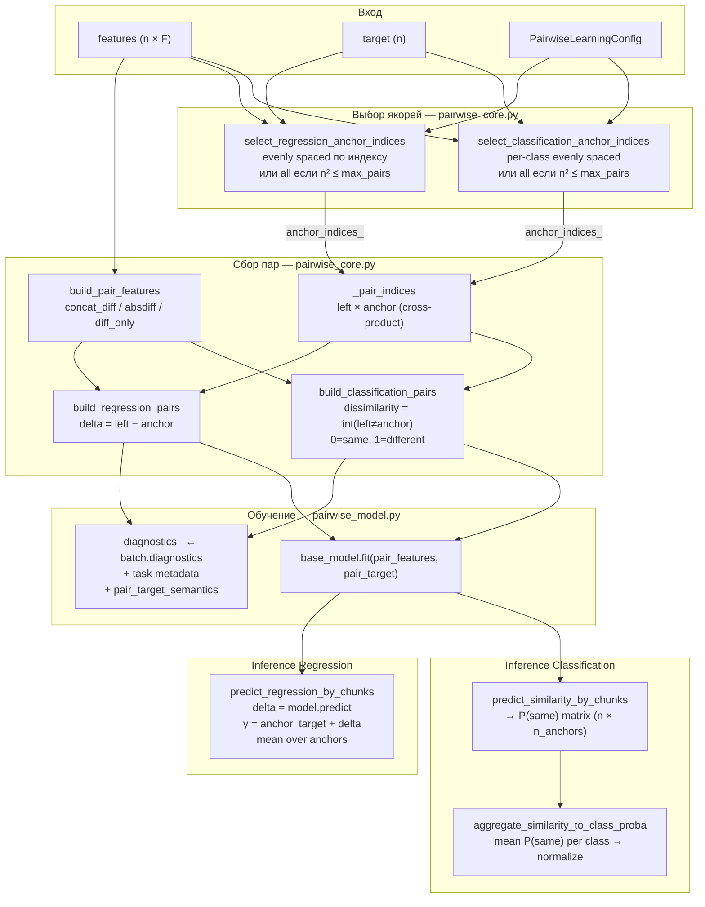
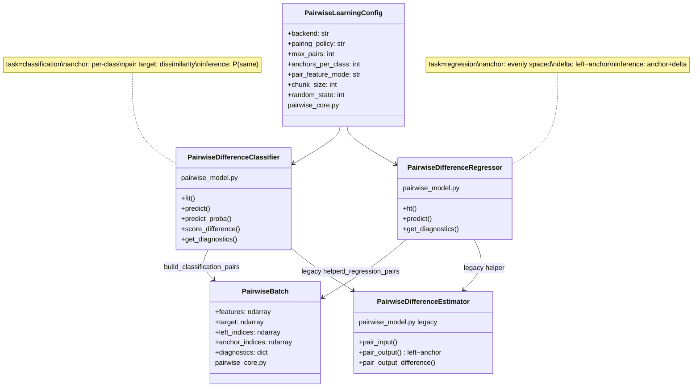
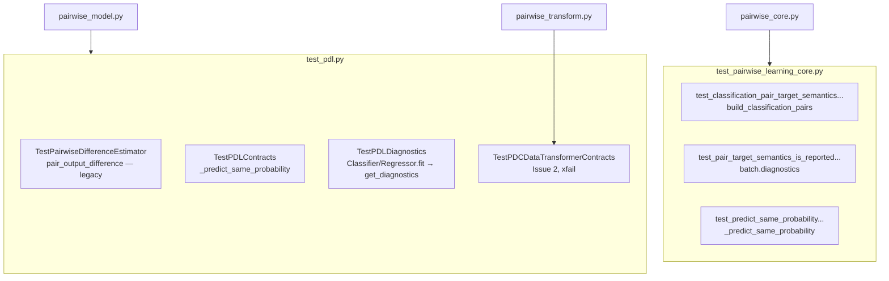

---

## Отчёт по выполнению PR 1

Статус: **Issue 1 — выполнен** (с оговорками ниже). **Issue 2 — частично** (тесты добавлены, код transformer не починен).

Затронутые файлы:

```text
fedot_ind/core/models/pdl/pairwise_core.py      — контракты, diagnostics, имена
fedot_ind/core/models/pdl/pairwise_model.py     — legacy API, score_difference
tests/unit/core/models/test_pdl.py              — estimator + legacy + PDC (xfail)
tests/unit/core/models/test_pairwise_learning_core.py — core-level контракты
```

Не изменялись в рамках PR 1:

```text
fedot_ind/core/models/pdl/pairwise_transform.py  — Issue 2, только тесты-заготовки
fedot_ind/core/models/pdl/__init__.py
```

---

### 1. Явные constants/metadata для classification target semantics

**Статус: выполнено**

**Файл:** `pairwise_core.py`, строки 14–16

**Добавлено:**

```python
CLASSIFICATION_SAME_LABEL = 0
CLASSIFICATION_DIFFERENT_LABEL = 1
REGRESSION_DELTA_SIGN = "left_minus_anchor"
```

**Где используется:**

| Константа | Файл | Функция / место |
|---|---|---|
| `CLASSIFICATION_SAME_LABEL` | `pairwise_core.py` | `_predict_same_probability` — выбор столбца P(same) из `predict_proba`; fallback `predict == 0` |
| `CLASSIFICATION_SAME_LABEL`, `CLASSIFICATION_DIFFERENT_LABEL` | `pairwise_core.py` | `_pair_target_semantics(task="classification")` → поля `same_label`, `different_label` |
| `REGRESSION_DELTA_SIGN` | `pairwise_core.py` | `_pair_target_semantics(task="regression")` → поле `delta_sign` |

**Не сделано (non-blocking):** module-level docstring в начале `pairwise_core.py` (в Issue 1 указан, но не блокирует acceptance).

---

### 2. Политика имён: `same` и `different` не смешиваются

**Статус: выполнено в active path и legacy helper**

#### Classification — training target

| Было | Стало | Файл |
|---|---|---|
| `pair_target = (left != anchor)` | `dissimilarity_target = (left != anchor)` | `pairwise_core.py`, `build_classification_pairs` (~143) |
| — | `dissimilarity_target` + docstring контракта `0=same, 1=different` | `pairwise_model.py`, `pair_output_difference` (~65–78) |

**Семантика (зафиксированный контракт):**

```text
same_label           = 0   → одинаковый класс
different_label      = 1   → разные классы
dissimilarity_target = int(left_class != anchor_class)   # 0 если same, 1 если different
```

**В `PairwiseBatch.target`** по-прежнему поле называется `target` (публичная структура не менялась), но в него кладётся `dissimilarity_target`.

#### Classification — inference / scoring

| Было | Стало | Файл |
|---|---|---|
| `similarity = predict_similarity_by_chunks(...)` | `same_probability = predict_similarity_by_chunks(...)` | `pairwise_model.py`, `score_difference` (~174) |
| `target_difference` | `dissimilarity_target` | `pairwise_model.py`, `score_difference` (~175–176) |
| `predicted_difference = 1.0 - similarity` | `predicted_dissimilarity = 1.0 - same_probability` | `pairwise_model.py`, `score_difference` (~177) |

**В `predict_similarity_by_chunks`** локальная переменная `same_probability` (~211) — это P(class == `same_label`), не «разность» и не dissimilarity.

**Не переименовано (косметика, поведение то же):**

- `aggregate_similarity_to_class_proba(similarity, ...)` — аргумент по-прежнему `similarity`, по смыслу это матрица P(same).
- `_predict_encoded_proba`: локально `similarity = predict_similarity_by_chunks(...)` (~185).

#### Regression — training target

| Было | Стало | Файл |
|---|---|---|
| `pair_target = left - anchor` | `delta_left_minus_anchor = left - anchor` | `pairwise_core.py`, `build_regression_pairs` (~166) |
| `return anchor - left` | `delta_left_minus_anchor = left - anchor` | `pairwise_model.py`, `pair_output` (~60–63) |

---

### 3. Regression sign convention `left - anchor`

**Статус: выполнено, active path и legacy выровнены**

**Формула:**

```text
delta_left_minus_anchor = target_left - target_anchor
feature difference      = left_features - anchor_features   # concat_diff, diff_only
inference               = anchor_target + predicted_delta
```

**Где зафиксировано:**

| Место | Файл |
|---|---|
| `build_regression_pairs` | `pairwise_core.py` ~166 |
| `predict_regression_by_chunks` (`anchor_target + deltas`) | `pairwise_core.py` ~233–234 |
| `_build_pair_features_numpy` (`left - anchors`) | `pairwise_core.py` ~282 |
| Legacy `pair_output` | `pairwise_model.py` ~60–63 |

**Тесты:** `test_regression_pair_target_is_left_minus_anchor` (`test_pdl.py`), `test_regression_pair_target_uses_left_minus_anchor_sign_convention` (`test_pairwise_learning_core.py`).

**Удалено из тестов:** старый `test_pair_output` с ожиданием `anchor - left` (`y2 - y1`); заменён на `test_regression_pair_target_is_left_minus_anchor`.

---

### 4. `pair_target_semantics` в diagnostics

**Статус: выполнено**

**Добавлено:**

| Элемент | Файл | Строки |
|---|---|---|
| `_pair_target_semantics(task)` | `pairwise_core.py` | ~303–321 |
| параметр `task` в `_pair_diagnostics` | `pairwise_core.py` | ~346–366 |
| `task="classification"` в `build_classification_pairs` | `pairwise_core.py` | ~150 |
| `task="regression"` в `build_regression_pairs` | `pairwise_core.py` | ~173 |
| ключ `"pair_target_semantics"` в return diagnostics | `pairwise_core.py` | ~365 |

**Цепочка до внешнего API:**

```text
build_*_pairs → batch.diagnostics["pair_target_semantics"]
    → PairwiseDifferenceClassifier/Regressor.fit → self.diagnostics_
    → get_diagnostics()
```

**Пример classification:**

```json
{
  "task": "classification",
  "same_label": 0,
  "different_label": 1,
  "target_type": "dissimilarity",
  "target_formula": "int(left_class != anchor_class)",
  "inference_output": "same_probability"
}
```

**Пример regression:**

```json
{
  "task": "regression",
  "delta_sign": "left_minus_anchor",
  "target_formula": "target_left - target_anchor",
  "inference_reconstruction": "anchor_target + predicted_delta"
}
```

**Тесты:**

- `test_pair_target_semantics_is_reported_in_diagnostics` — core (`test_pairwise_learning_core.py`)
- `test_pair_target_semantics_is_reported_in_diagnostics_classifier` / `_regressor` — estimator (`test_pdl.py`, `TestPDLDiagnostics`)

---

### 5. Починить `PDCDataTransformer` или вывести в legacy

**Статус: не выполнено (Issue 2 отложен)**

**Текущие проблемы в `pairwise_transform.py` (без изменений):**

- `fit()` не создаёт `preprocessing_` для X;
- `transform()` вызывает `self.preprocessing_.transform(X)` → AttributeError при реальном использовании;
- для `y` вызывается `preprocessing_.transform(y)` вместо `preprocessing_y_.transform(y)` (~102–103);
- `warnings.catch_warnings()` (~196) без `import warnings`.

**Сделано вместо починки:** добавлены контракт-тесты с `@pytest.mark.xfail` в `test_pdl.py` → `TestPDCDataTransformerContracts`:

- `test_pdc_data_transformer_initializes_x_preprocessor`
- `test_pdc_data_transformer_uses_y_preprocessor_for_target`

Тесты документируют ожидаемое поведение; после фикса transformer — снять `xfail`.

---

### 6. Недостающие imports

**Статус: N/A для production-кода PR 1; Issue 2 — не исправлен**

В `pairwise_transform.py` по-прежнему отсутствует `import warnings` (баг Issue 2).

В тестах добавлены импорты: `_predict_same_probability`, `PDCDataTransformer`, `StandardScaler`, `patch` (`test_pdl.py`).

---

### 7. Тесты на deterministic toy arrays

**Статус: выполнено**

#### `tests/unit/core/models/test_pdl.py`

| Тест | Класс | Что проверяет |
|---|---|---|
| `test_regression_pair_target_is_left_minus_anchor` | `TestPairwiseDifferenceEstimator` | legacy `pair_output`: `[0, -2, 2, 0]` |
| `test_classification_pair_target_semantics_same_is_zero_current_contract` | `TestPairwiseDifferenceEstimator` | legacy `pair_output_difference`: `[0, 0, 1]` |
| `test_pair_output_difference` | `TestPairwiseDifferenceEstimator` | расширенный кейс 3×2 пар (оставлен) |
| `test_predict_same_probability_uses_same_label_column` | `TestPDLContracts` | столбец class 0 из `predict_proba` |
| `test_predict_same_probability_falls_back_to_hard_predictions` | `TestPDLContracts` | `predict` без `predict_proba` |
| `test_pair_target_semantics_is_reported_in_diagnostics_classifier` | `TestPDLDiagnostics` | semantics после `Classifier.fit` |
| `test_pair_target_semantics_is_reported_in_diagnostics_regressor` | `TestPDLDiagnostics` | semantics после `Regressor.fit` |
| `test_pdc_data_transformer_*` | `TestPDCDataTransformerContracts` | Issue 2, xfail |

Заглушки `_PairProbaStub`, `_HardLabelStub` вместо `MagicMock` — проще читать и стабильнее в CI.

#### `tests/unit/core/models/test_pairwise_learning_core.py`

| Тест | Что проверяет |
|---|---|
| `test_classification_pair_target_semantics_same_is_zero_current_contract` | `build_classification_pairs` → `[0, 0, 1]` |
| `test_pair_target_semantics_is_reported_in_diagnostics` | `batch.diagnostics` clf + reg |
| `test_predict_same_probability_uses_same_label_column` | `_predict_same_probability` на уровне core |
| `test_regression_pair_target_uses_left_minus_anchor_sign_convention` | delta + feature blocks |

**Запуск:**

```bash
pytest tests/unit/core/models/test_pdl.py tests/unit/core/models/test_pairwise_learning_core.py -v
```

---

## Соответствие Issue 1 — acceptance criteria

| Критерий | Статус | Где проверено |
|---|---|---|
| Контракт classification target явно описан | ✅ | константы, `_pair_target_semantics`, docstring `pair_output_difference` |
| Контракт regression target явно описан | ✅ | `delta_left_minus_anchor`, `REGRESSION_DELTA_SIGN`, diagnostics |
| Diagnostics возвращает `pair_target_semantics` | ✅ | `_pair_diagnostics`, тесты `TestPDLDiagnostics` |
| Backward compatibility сохранена | ✅ | публичное поведение clf/reg не менялось; `PairwiseBatch.target` — то же поле |
| Тесты проверяют values и interpretation | ✅ | exact arrays на toy data |

**Non-goals соблюдены:** classification target `0=same, 1=different` не менялся; posterior aggregation не добавлялась.

---

## Соответствие Issue 2 — acceptance criteria

| Критерий | Статус |
|---|---|
| `fit().transform()` не падает на базовых сценариях | ❌ `preprocessing_` не инициализируется |
| X и y — разные pipelines | ❌ `y` идёт через `preprocessing_` |
| Нет обращения к неинициализированным attributes | ❌ |
| Тесты `test_pdc_data_transformer_*` | ✅ добавлены (xfail) |
| `test_pdc_data_transformer_handles_numeric/categorical` | ❌ не добавлены |

**Рекомендация для следующего PR:** починить `PDCDataTransformer` или перенести в `legacy.py`; снять `xfail` с двух тестов.

---

## Критерии приёмки PR 1 — итог

| Критерий | Статус |
|---|---|
| Поведение default classifier/regressor не меняется | ✅ |
| Diagnostics явно сообщает target semantics | ✅ |
| Нет обращения к неинициализированным attributes в transformer | ❌ Issue 2 |
| Все PDL unit tests проходят | ✅ (кроме 2 xfail по PDC) |

---

## Остаточный техдолг (вне scope закрытого PR 1)

- Удалить закомментированную строку `# pair_target = ...` в `build_classification_pairs` (`pairwise_core.py` ~142).
- Module-level docstring в `pairwise_core.py`.
- TypedContract для `PairwiseBatch.diagnostics` (TODO в коде).
- Починка `PDCDataTransformer` (Issue 2).
- Переименовать `similarity` → `same_probability_matrix` в `_predict_encoded_proba` (косметика).

