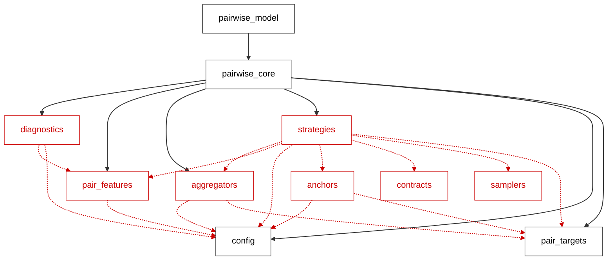
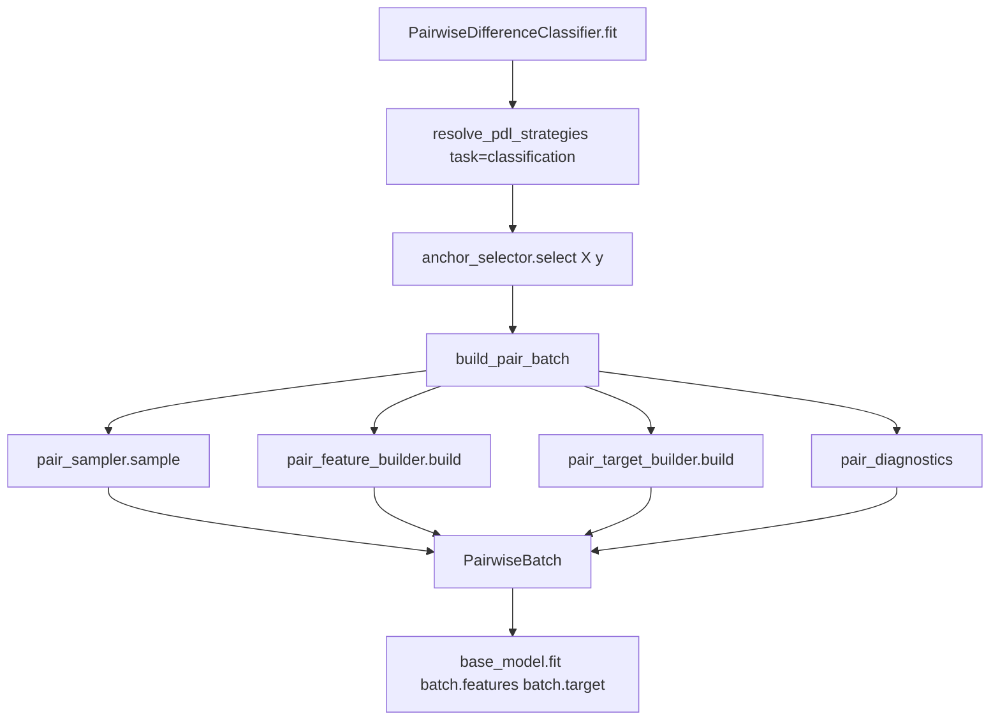

# PDL Strategy Architecture (PR2)

This document describes the strategy-based refactor of `fedot_ind/core/models/pdl`. It explains how the module is structured, how data flows through training and inference, and where to plug in new behavior.

## What changed in PR2

Before PR2, most PDL logic lived in two large files:

- `pairwise_core.py` — anchors, pair features, pair targets, chunking, aggregation
- `pairwise_model.py` — sklearn/FEDOT estimator facades

PR2 splits responsibilities into small, replaceable **strategies** behind `typing.Protocol` contracts. The public API of `PairwiseDifferenceClassifier`, `PairwiseDifferenceRegressor` and `PairwiseDifferenceEstimator` is unchanged.

The default behavior for the standard config is also unchanged.

## Module map

```text
fedot_ind/core/models/pdl/
  aggregators.py      # classification probability aggregation
  anchors.py          # anchor selectors
  config.py           # PairwiseLearningConfig, PairwiseBatch, constants
  contracts.py        # Protocol interfaces (structural typing)
  diagnostics.py      # pair_target_semantics, pair_diagnostics
  pair_features.py    # feature normalization + pair feature builders
  pair_targets.py     # classification/regression pair target builders
  pairwise_core.py    # backward-compatible facade + chunking inference
  pairwise_model.py   # estimator facades (thin wiring over strategies)
  samplers.py         # pair index generation (cross-product)
  strategies.py       # resolve_pdl_strategies(), PDLStrategies bundle
  pdl_model_registry.py
```




### Layering

| Layer | Responsibility |
|-------|----------------|
| `contracts.py` | Declares what a strategy must implement |
| `config.py` | User-facing knobs and validation |
| `*features/targets/anchors/samplers/aggregators.py` | Default strategy implementations |
| `strategies.py` | Wires config + task → concrete strategy objects |
| `pairwise_core.py` | Orchestration (`build_pair_batch`) and legacy re-exports |
| `pairwise_model.py` | further integration of the module |

## Core contracts

### Classification

- Training target: **dissimilarity** — `0 = same class`, `1 = different class`
- Inference: base model predicts dissimilarity; runtime converts to **P(same)**
- Aggregation: mean similarity per class → row-normalized class probabilities

### Regression

- Training target: **delta** = `target_left - target_anchor`
- Inference: `predicted_target = anchor_target + predicted_delta`, averaged over anchors

These contracts are documented in code constants (`CLASSIFICATION_SAME_LABEL`, etc.)
and exposed at runtime via `diagnostics["pair_target_semantics"]`.

## Execution flow

### Training (classification)



Step by step:

1. `PairwiseDifferenceClassifier.__init__` calls `resolve_pdl_strategies(config, task="classification")`.
2. `fit()` encodes labels, then `strategies_.anchor_selector.select(train_features_, target_encoded_)`.
3. `build_pair_batch(...)` composes:
   - `AllPairsSampler` → left/anchor index arrays
   - configured `PairFeatureBuilder` → pair feature matrix
   - `ClassificationDissimilarityTargetBuilder` → dissimilarity targets
   - `pair_diagnostics()` → runtime metadata
4. The sklearn base model trains on `(pair_features, pair_target)`.

### Inference (classification)

1. `predict_similarity_by_chunks()` builds pair features in chunks and reads **P(same)** via `_predict_same_probability()`.
2. `strategies_.pair_aggregator.aggregate()` (`MeanSimilarityAggregator`) converts the similarity matrix into class probabilities.

### Training / inference (regression)

Same pattern, but:

- `RegressionEvenAnchorSelector`
- `RegressionDeltaLeftMinusAnchorTargetBuilder`
- no classification aggregator
- `predict_regression_by_chunks()` for inference

## Strategy resolution

Entry point: `strategies.resolve_pdl_strategies(config, task=...)`.

Returns a frozen `PDLStrategies` dataclass:

```python
@dataclass(frozen=True)
class PDLStrategies:
    config: PairwiseLearningConfig
    task: str
    anchor_selector: AnchorSelector
    pair_feature_builder: PairFeatureBuilder
    pair_target_builder: PairTargetBuilder
    pair_sampler: PairSampler
    pair_aggregator: PairAggregator | None  # None for regression
```

Resolution rules:

| Task | Anchor selector | Target builder | Aggregator |
|------|-----------------|----------------|------------|
| `classification` | `ClassificationAdaptiveAnchorSelector` | `ClassificationDissimilarityTargetBuilder` | `MeanSimilarityAggregator` |
| `regression` | `RegressionEvenAnchorSelector` | `RegressionDeltaLeftMinusAnchorTargetBuilder` | `None` |

`pair_feature_mode` selects one of:

- `ConcatDiffPairFeatureBuilder`
- `ConcatAbsdiffPairFeatureBuilder`
- `DiffOnlyPairFeatureBuilder`

`AllPairsSampler` is currently the only sampler (full cross-product).

### PR3 guards

Until posterior aggregation is implemented, these configs raise `NotImplementedError`:

- `aggregation_policy` other than `mean_similarity` (classification)
- `symmetric_inference=True`

Config validation still accepts aliases like `posterior` → `paper_posterior`, but
runtime strategy resolution rejects non-default policies explicitly.

## Protocol interfaces

Defined in `contracts.py`. Concrete classes **do not need to inherit** from them;
they only need matching method signatures (structural subtyping).

| Protocol | Method | Purpose |
|----------|--------|---------|
| `PairFeatureBuilder` | `build(left, anchors)` | Pair feature matrix |
| `PairTargetBuilder` | `build(y_left, y_anchor)` | Per-pair supervision target |
| `AnchorSelector` | `select(X, y)` | Training anchor indices |
| `PairSampler` | `sample(n_left, anchor_indices)` | Pair index expansion |
| `PairAggregator` | `aggregate(pair_predictions, anchor_labels, n_classes=...)` | Class probabilities |
| `UncertaintyEstimator` | `estimate(...)` | Reserved for PR3 |

## How to extend the module

### Add a new pair feature mode

1. Implement `build(left, anchors)` in a new class under `pair_features.py`.
2. Register it in `resolve_pair_feature_builder()`.
3. Add the mode name to `SUPPORTED_PAIR_FEATURE_MODES` in `config.py`.
4. Add unit tests in `tests/unit/core/models/test_pdl_PR2.py`.

### Add a new anchor policy

1. Implement `AnchorSelector` in `anchors.py`.
2. Extend `resolve_pdl_strategies()` (or introduce a dedicated resolver/registry).
3. Add a new `pairing_policy` value to `PairwiseLearningConfig.normalized()`.
4. Add reproducibility / coverage tests.

### Add balanced pair sampling (planned PR4)

1. Implement `PairSampler` in `samplers.py` (e.g. `BalancedPairsSampler`).
2. Switch sampler selection inside `resolve_pdl_strategies()`.
3. Extend diagnostics with pair balance metrics.

### Add posterior aggregation (planned PR3)

1. Implement `PairAggregator` in `aggregators.py`.
2. Extend `resolve_pair_aggregator()`.
3. Remove the `NotImplementedError` guard for the new policy.
4. Optionally implement `UncertaintyEstimator`.

### Add a new regression target mode (planned PR7)

1. Implement `PairTargetBuilder` in `pair_targets.py`.
2. Select it from `resolve_pdl_strategies()` based on a new config field.
3. Document the sign convention in `pair_target_semantics()`.

<!-- ## Backward compatibility

`pairwise_core.py` remains the compatibility layer. External code and tests may
still import:

- `build_classification_pairs`, `build_regression_pairs`
- `select_classification_anchor_indices`, `select_regression_anchor_indices`
- `aggregate_similarity_to_class_proba`
- `build_pair_features`, `pair_feature_dim`
- `_predict_same_probability`

Internally these delegate to the strategy modules.

`fedot_ind.core.models.pdl.__init__` uses lazy imports for estimators so that
`pairwise_core` can be imported without the full FEDOT stack. -->

## Configuration reference

Key `PairwiseLearningConfig` fields:

| Field | Role |
|-------|------|
| `pair_feature_mode` | Pair feature layout (`concat_diff`, ...) |
| `pairing_policy` | Anchor selection policy |
| `max_pairs` | Memory budget for pair count |
| `anchors_per_class` | Anchor budget per class (classification) |
| `backend` | `numpy` / `torch` pair feature backend |
| `chunk_size` | Inference chunking |
| `random_state` | Reserved for future stochastic strategies |
| `aggregation_policy` | Classification aggregation (only `mean_similarity` active) |
| `symmetric_inference` | Reserved for PR3 |
| `class_prior_mode` | Reserved for PR3 posterior aggregation |

## Diagnostics

Every `PairwiseBatch` carries a `diagnostics` dict built by `pair_diagnostics()`.

Important keys:

- `n_train`, `n_anchors`, `n_pairs`, `pair_feature_dim`
- `anchor_indices`
- `config` — full normalized config snapshot
- `pair_target_semantics` — active mathematical contract

Estimator `fit()` merges batch diagnostics with task-specific fields
(`n_classes`, `base_model`, etc.).

## Tests

| File | Focus |
|------|-------|
| `test_pdl_PR2.py` | Strategy resolution, guards, batch building |
| `test_pairwise_learning_core.py` | Core math contracts and backward-compat API |
| `test_pdl.py` | Estimator API, diagnostics, legacy helper |
| `test_pairwise_difference_models.py` | End-to-end FEDOT InputData smoke tests |

<!-- ## Design notes

- **Why Protocol, not ABC?** Strategies stay decoupled; tests can inject small fakes without inheritance. Same pattern as `kernel_learning/contracts.py`.
- **Why `build_pair_batch`?** Single orchestration point avoids duplicating sampler/feature/target wiring in classification and regression paths.
- **Why keep `pairwise_core.py`?** Preserves import paths and isolates chunking inference, which is infrastructure rather than a swappable policy in PR2. -->
