# Визуальная Архитектурная Схема Forecasting Stack

## Назначение

Этот документ дополняет [forecasting_developer_onboarding.md](./1.Онбординг для разработчиков новых релизов) и даёт
быстрый
визуальный вход в forecasting-архитектуру `Fedot.Industrial`.

Его удобно использовать:

- как первую карту при onboarding;
- как краткую шпаргалку во время рефакторинга;
- как reference при обсуждении новых моделей, tuning-flow и benchmark integration.

## 1. Общая Архитектура Forecasting Stack

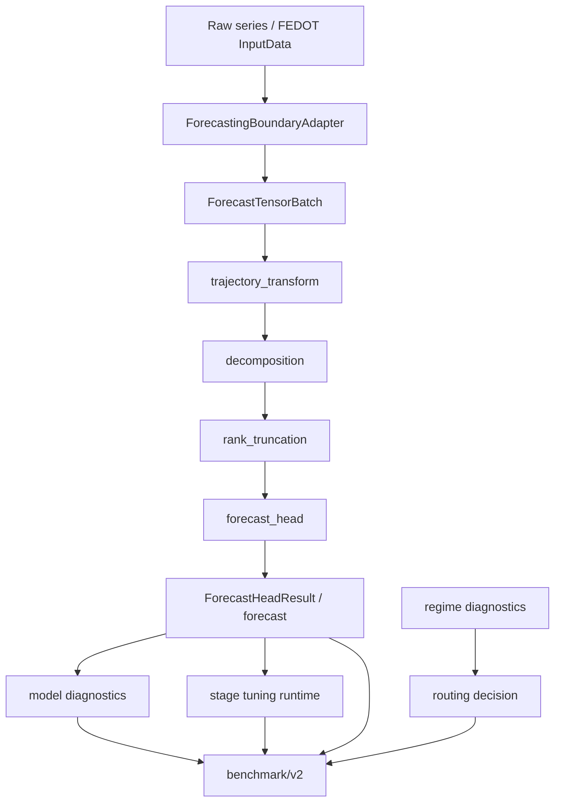

### Что важно помнить

- `InputData/OutputData` — это boundary-layer, а не внутренний forecasting runtime.
- Внутри runtime canonical transport object — `ForecastTensorBatch`.
- Внутренний stage-first vocabulary:
    - `trajectory_transform`
    - `decomposition`
    - `rank_truncation`
    - `forecast_head`

## 2. Слои Системы

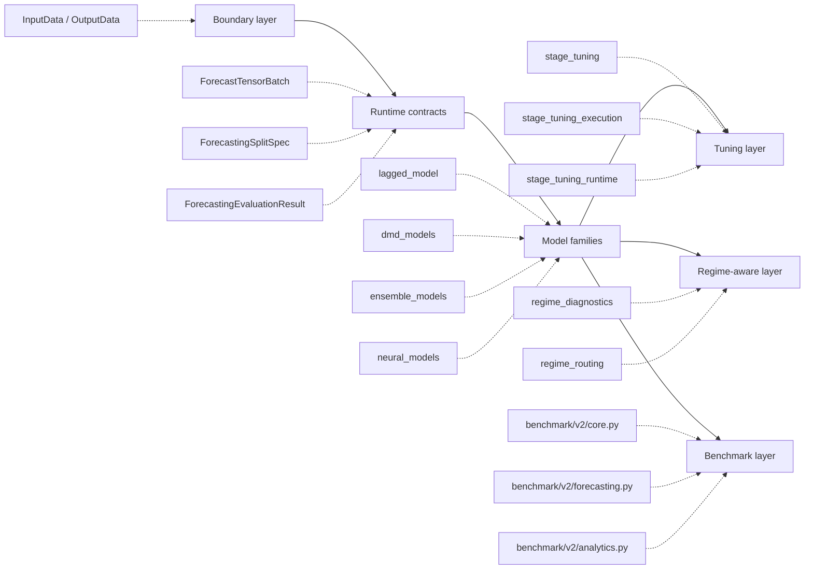

## 3. Карта Model Families

```mermaid
flowchart TD
    A["ts_forecasting"] --> B["lagged_model"]
    A --> C["dmd_models"]
    A --> D["ensemble_models"]
    A --> E["neural_models"]
    A --> F["forecast_tuning"]
    A --> G["regime_utils"]
    A --> H["lagged_strategy (compat)"]

    B --> B1["lagged_ridge_forecaster"]
    B --> B2["low_rank_lagged_ridge_forecaster"]
    B --> B3["ssa_forecaster"]
    B --> B4["mssa_forecaster"]
    B --> B5["topo_forecaster"]

    C --> C1["havok_forecaster"]
    C --> C2["okhs_fdmd_forecaster"]

    D --> D1["hybrid_ensemble_forecaster"]

    E --> E1["neural_forecast_head"]
    E --> E2["neural_forecast_head_bridge"]

    F --> F1["stage plans"]
    F --> F2["sequential tuning"]
    F --> F3["series evaluation"]

    G --> G1["regime diagnostics"]
    G --> G2["routing decision"]
```

### Семейства и смысл

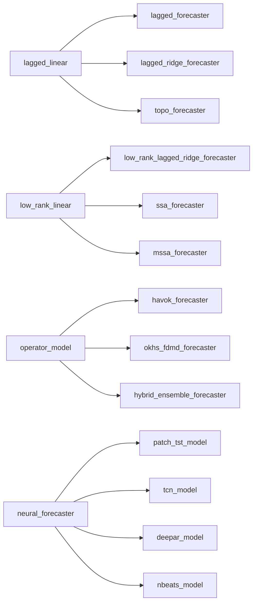

## 4. Runtime Contracts

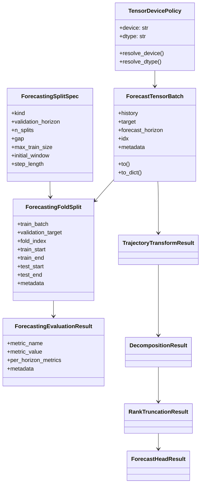

### Ключевая идея

Если новый forecasting path нельзя описать через эти runtime contracts, значит он пока плохо встраивается в текущую
архитектуру.

## 5. Stage-Tuning Архитектура

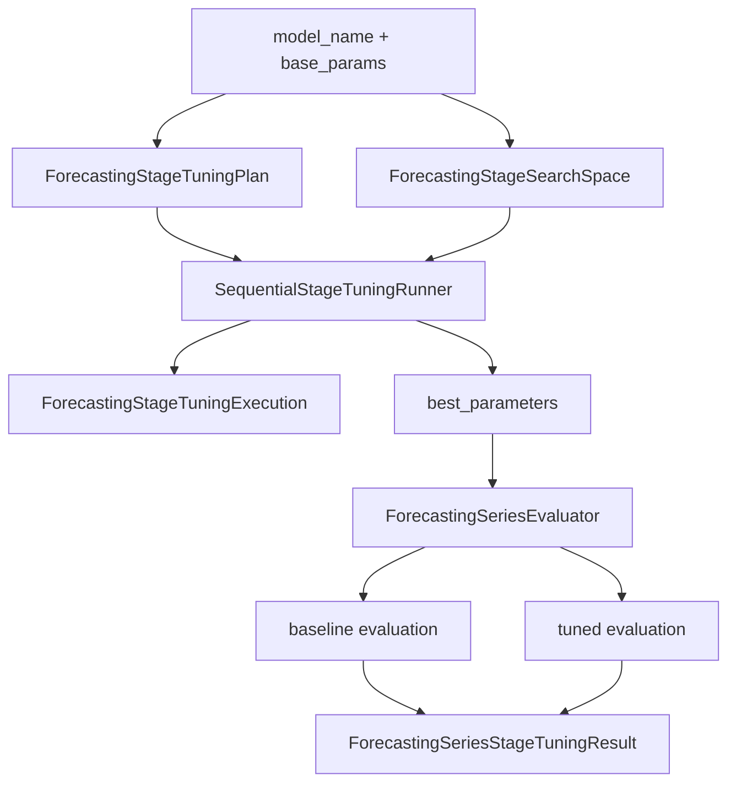

### Типовой порядок стадий

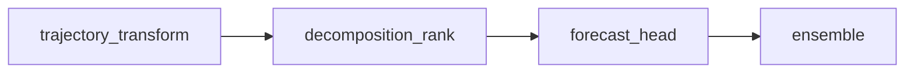

### Для чего это нужно

- tuning идёт не по одному неразборчивому `param blob`;
- можно дебажить, на какой стадии качество реально меняется;
- benchmark может публиковать `baseline vs tuned` не как магию, а как stage-aware процесс.

## 6. Regime-Aware Слой

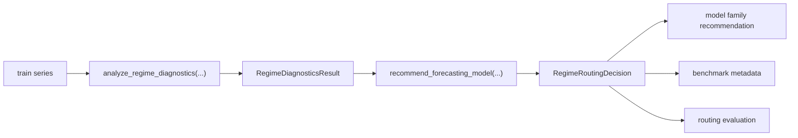

### Практический смысл

- routing — это отдельный доменный слой, а не часть конкретной forecasting-модели;
- benchmark сравнивает не только “кто лучше предсказал”, но и “насколько routing вообще попал в правильную family”.

## 7. Архитектура `benchmark/v2`

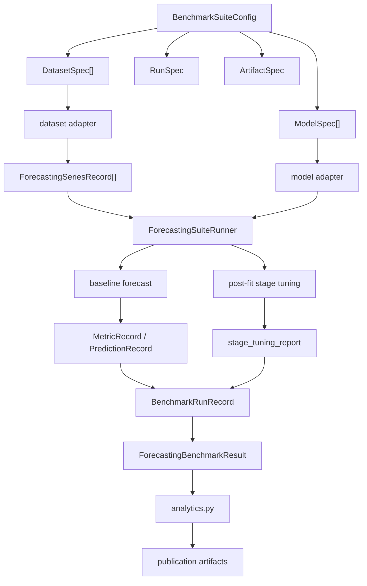

### Основные benchmark contracts

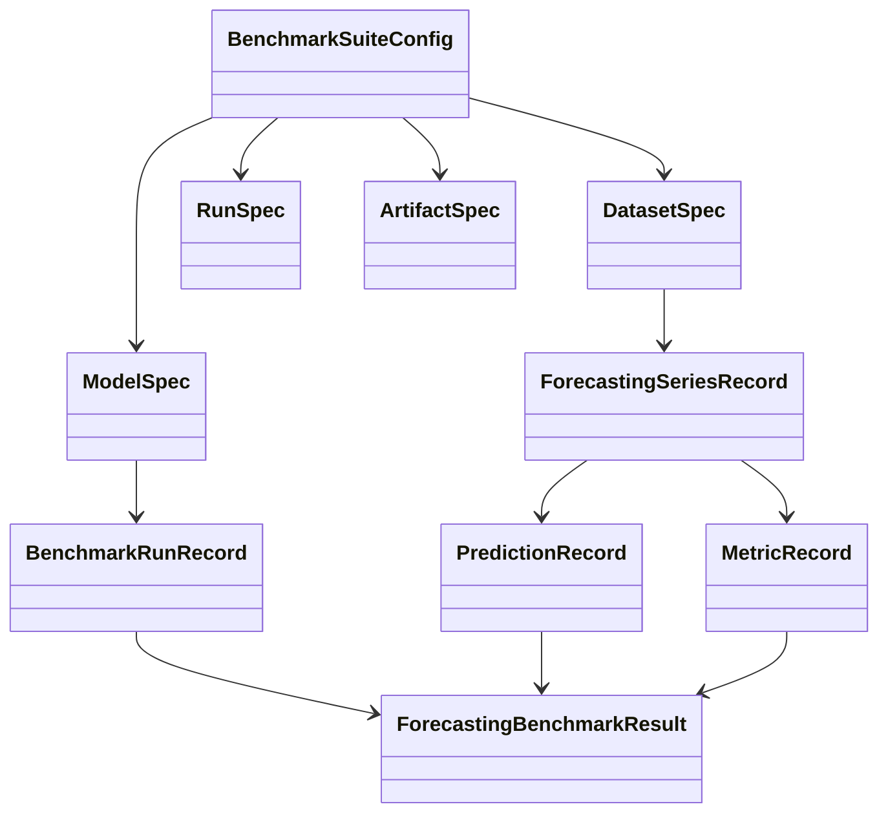

## 8. Как Новая Модель Встраивается В Систему

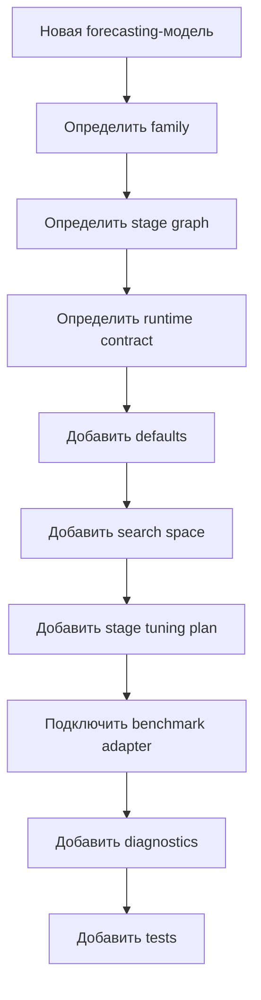

### Минимальный integration checklist

- модель имеет canonical name;
- есть defaults;
- есть stage-tuning contract;
- есть benchmark adapter path;
- есть diagnostics и family mapping;
- есть mirrored tests.

## 9. Как Дебажить Forecasting Stack По Слоям

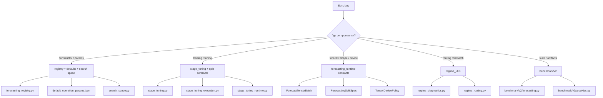

## 10. Практический Use Case: Что Открывать Первым

### Если баг в модели

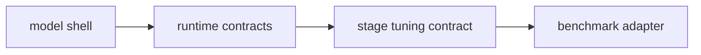

### Если баг в benchmark suite

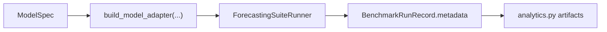

### Если нужно быстро понять архитектуру

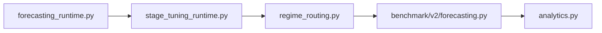

---

## Краткий Итог

Forecasting stack в Industrial лучше всего понимать так:

- **runtime contracts** задают язык;
- **model families** реализуют разные forecasting-подходы;
- **stage tuning** управляет оптимизацией по этапам;
- **regime-aware layer** отвечает за диагностику и routing;
- **benchmark/v2** превращает всё это в records, artifacts и сравнимые результаты.

Если разработчик видит эту систему именно в таком порядке, вход в forecasting-слой становится заметно проще.
