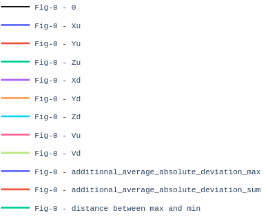
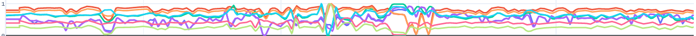
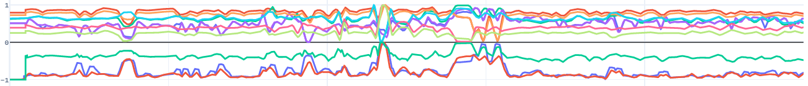
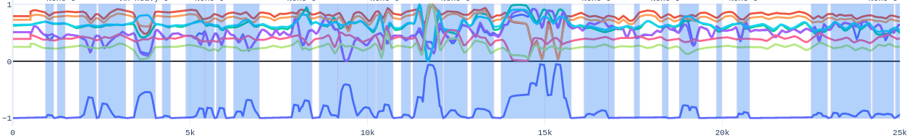

Welcome to Time Series Anomaly Detection Module's documentation!
================================================================

Here you can find comprehensive documentation for the TSADM - Time Series Anomaly Detection Module

Content:
--------

Introduction
------------

This module is special module for anomaly detection and recognition anomalies in data ~~~~

Pipeline
--------

In process of research and development of module was created pipeline architecture. It increased speed of development and have been allowing to combine numerous operations in different order very fast.

Elements of pipeline supports simplistic interface - four methods only:

set_settings - for set params of logs_output and visualisation

load_data - for loading object into operation

run_operation - for making operation

return_new_data - for return changed data object

Also pipeline splited in two - initialization and detection pipeline. First one only load data into module - dataset and time series for analysis, second one make detection.

Preparing data
~~~~~~~~~~~~~~

First of all it's good to set the scene. Data that module works with split in files, each one of which contains set of time series that show some data of scanning of underground gas pipelines. Example of such time series shows here:

------------------------------------------------------

.. figure:: Images/Original_TS.png
       :scale: 300 %
       :align: center
       :alt: Typical time series configuration

As could be notice, data here looks very chaotic and "dirty" with noices, but main trouble lies deeper.
Also there is given a legend for visualization, it's actual for every images here:

------------------------------------------------------

First of all module cleanse data and made a little bit of standartization on time series by smoothing, moving and normalizing them:

------------------------------------------------------

       This data is such it could be possible to work with.

Feature aggregation
~~~~~~~~~~~~~~~~~~~

Time series in data files differents a lot from file to file - it's actually depends on a big variety of factors of real world, so it couldn't be changed.
Because of this we can't reliy upon values-based data of one or several time series. But we have more than one time series, so it could be possible to extract some usefull data based on relative configuration of all time series using feature aggregation.

There is several ways to do so, but it was three that looks most promisable: max-min distance, max average absolute deviation and sum of average absolute deviation. Exaples of this three additional time series show as follow:

------------------------------------------------------

       Three graphs between -1 and 0 shows how aggregated time series reflecting changing of configurations of main time series. Green one is max-min distance, dark blues one is max of average absolute deviation and red is sum of average absolute deviation.

------------------------------------------------------

As could be seen max-min distance could show zones when several of main time series goes in countephases. The central anomalie is a good example. But it works worce than average-based time series.
Both average deviations-based graphs shows good results in reflecting big changes of main time series, but maximum-based time series works better. It's so because maximum-based aggregation show if even only one of main time series shows big deviation from it's average.

Agreggated data splitting
-------------------------

Splitting aggregated data to zones are essential for furcher detection. Cutting additional time series by threshold is suitable for this purpose.

Adaptive threshold cutting
~~~~~~~~~~~~~~~~~~~~~~~~~~

But how to choose the value of threshold? Adaptive threshold provide an answer for this question. User could choose percentage of points on the TS that has to be cut. After that adaptive method search for suitable value of threshold, cut and normilize ts.

------------------------------------------------------

.. figure:: Images/Split_aggregated_data.png
       :scale: 300 %
       :align: center
       :alt: Typical time series configuration

       This data is such it could be possible to work with. TS split by zero-zones.

------------------------------------------------------

       Zones.

Anomaly zones search
--------------------

Now we have number of zones of time series that could be worked with without problems. First step of analysis of this zones is features extraction.

Features vector extracting
~~~~~~~~~~~~~~~~~~~~~~~~~~

Question is - what features extract from each zones?
After research and a lot of attempts to combine different features and creating new ones I find following combination of features best sutable for the task:

max

sum

mean

median

mean_median_distance

compressing zone to 10 points

sum of distance of compress zone to 40 points

------------------------------------------------------

.. figure:: Images/Features_vectors.png
       :scale: 300 %
       :align: center
       :alt: Typical time series configuration

       Examples of vectors of anomaly zones of four types: from noice(grean) to critical(red) with light(dark blue) and heavy(yellow)

Clusterization method
~~~~~~~~~~~~~~~~~~~~~

Next stage 

------------------------------------------------------

.. figure:: Images/Clusters.png
       :scale: 300 %
       :align: center
       :alt: Typical time series configuration

       Clusters of anomaly zones from dataset.

Database method
~~~~~~~~~~~~~~~

Final predict
-------------

