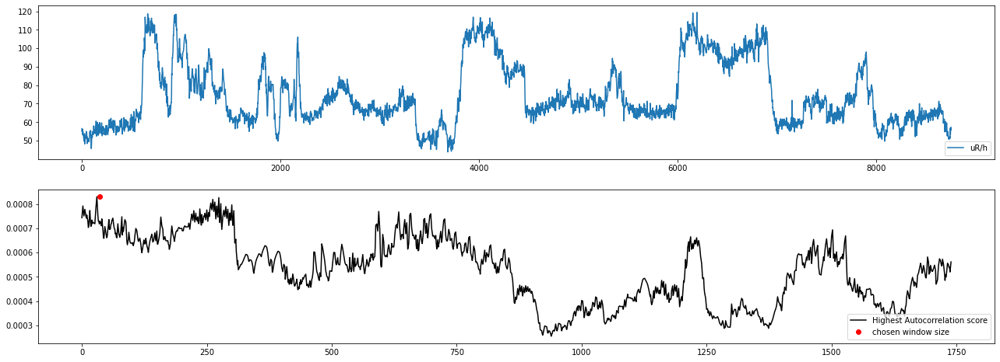
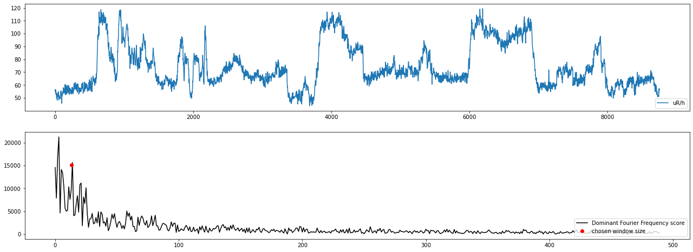
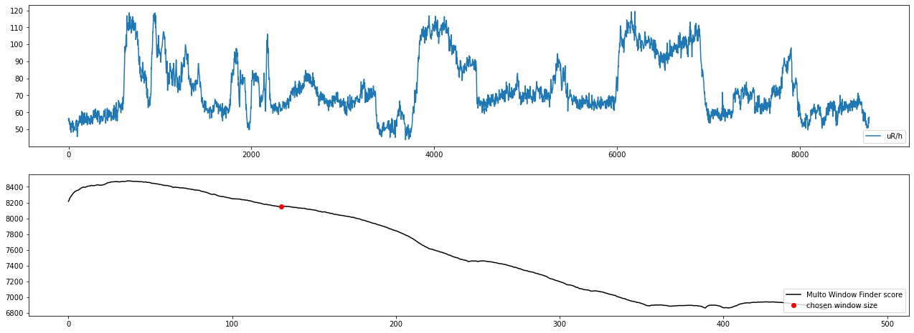
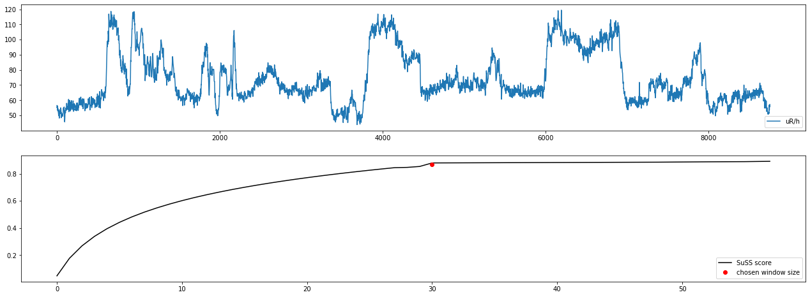

Change point detection
======================

Change point detection aims to find when the time series changes. The time series can be of any length and can be univariate or multivariate. 

The change point detection in the time series is the task of iterativly computing different score between two nearest subsequnces based on input data presented as a time-ordered data sequence.
The mathematical formulation of the problem can be presented in the following form:

.. math::

    \begin{equation}
      F: X\rightarrow  \mathbb{S}
    \end{equation}

where:

- :math:`X` is a time series of length :math:`t = [x_1, x_2, ..., x_t], x_i \in R`;
- :math:`F` is a singular spectrum transformation with some hyperparameters;
- :math:`S = [s_1, s_1,...,s_n]` a score list of the time series :math:`X`.

The time series change point detection experiment consists of the following steps:

- First, the time series is transformed into matrix of subsequences of a certain length for the past and present state.
- The next step is singular value decomposition of the matrix and compution distance score between matrixes.
- The final stage is computed a list score of differences and normalization as 1 and 0 over threshold quantile. 

Within the framework we use the window selection algorithm:

Window Size Selection Algorithms
--------------------------------

The :ref:`WSS <Window-Size-Selection>` method helps to chose apropriate hyperparameters as subsequences length and subsequnces of subsequnces length for :ref:`Singular Spectrum Transformation<SST>`.
This method is based on whole-series based or subsequences analysis.

For whole-series based analysis:

- Highest Autocorrelation Algorithm (HA)
- Dominant Fourier Frequency Algorithm (DFF)

For subsequnces based analysis:

- Multi Window Finder (MWF)
- Summary Statistics Subsequence (SuSS)

Highest Autocorrelation
````````````````````````
The Highest Autocorrelation algorithm consists of the following steps:

- Get a full delayed copy of the time series.
- Compute statistics for dalayed time series as mean and standart deviation.
- Compute statistics score between original time series and itself copy.
- Repeat computation for all statistics between minimum and maximum delayed copy of the time series.
- The final stage is to find the best length according to the highest score.



Dominant Fourier Frequency Algorithm
````````````````````````````````````
The Dominant Fourier Frequency algorithm consists of the following steps:

- Transform time series into a sum of sinusoid waves.
- Repeat computation for all possible lengths between max and minimum for the time series.
- The final stage is to find the best length according to the highest score.



Multi Window Finder
```````````````````
The Multi Window Finder algorithm consists of the following steps:

- Compute sum differences between moving average values to its mean in every single chosen subsequnces of time series.
- Repeat computation for all possible subsequnces lengths between max and minimum for the time series.
- The final stage is to find the first local minimum in a score list.



Summary Statistics Subsequence
```````````````````````````````
The Summary Statistics Subsequence algorithm consists of the following steps:

- Calculate whole time series statistics as mean, standard deviationand and range of values.
- Calculate the rolling time series statistics different subsequences of length between min and max for the time series.
- Calculate euclidian distance between general and subsequences statistics.
- The final stage is to find a candidate with the minimum euclidian distance in a list.




.. [1] Tsuyoshi Ide, Koji Tsuda, "Change-Point Detection using Krylov Subspace Learning",
       SIAM International Conference on Data Mining, pp.515-520, 2007

.. [2] Ermshaus, Arik, Patrick Schäfer, and Ulf Leser. "Window Size Selection In Unsupervised Time Series Analytics: A Review and Benchmark.", 2022
