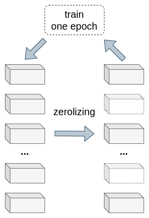

Computer vision
================

This framework supports working with two common types of tasks: image classification
and object detection on images.

Image classification
--------------------
Image classification is a computer vision task that assigns a label or category to an image based on its content.
The goal of image classification is to teach a computer to recognize and distinguish between different objects,
scenes, or patterns in images automatically.

Image classification involves training a machine-learning model on a labelled dataset of images.
The labelled dataset consists of images assigned one or more labels or categories. During training, the machine
learning model learns to recognize patterns and features in the images associated with each label or category.

Once the model has been trained, it can classify new, unseen images. The model analyzes the image's content and
assigns it to the most likely label or category based on its learned patterns and features.

Object detection
----------------
Object detection is another important computer vision task that involves identifying and localizing objects of
interest within an image or video. Unlike image classification, which only assigns a label or category to an entire
image, object detection can identify and locate multiple objects within an image and assign a label or category to
each object.

Object detection typically involves training a machine learning model on a labelled dataset of images, where each
image contains one or more objects of interest and the location of each object in the image is also labelled. During
training, the machine learning model learns to recognize patterns and features in the images associated with each
object and its location.

Once the model has been trained, it can detect and localize objects in new, unseen images. The model analyzes the
image's content and identifies the location of each object of interest, along with its label or category.

Semantic segmentation
---------------------
Work in progress.

Compression
-----------
Convolutional Neural Networks (CNNs) can be computationally expensive and
require significant memory and processing power, especially for large models
trained on large datasets.

To address this issue, researchers have developed various techniques for
compressing CNNs, which can reduce their size and computational requirements
while maintaining their performance.

This framework supports some common techniques for CNN compression:

**1. Low-rank Approximation**

This technique involves approximating the weight matrices in the CNN with low-rank matrices, which can be more
computationally efficient to compute and store.

This framework uses the singular value decomposition method.
This method proposes to train neural networks in a decomposed form. The kernel can be represented as a four-dimensional
tensor for a convolution layer. Therefore, it is necessary to transform the kernel into a two-dimensional tensor.
This work uses the channel-wise decomposition method and the spatial-wise decomposition method.
These methods allow to convert the kernel to the desired format.

Then, two types of regularization are introduced.
The first is orthogonality regularization for singular vector matrices, and the second is Hoer regularization for
reducing the rank of the singular value matrix. This approach avoids the decomposition procedure at each training step.

.. image:: img_basics/SVD.png
   :alt: Singular value decomposition
   :height: 500px
   :align: center

**2. Pruning**

This technique removes unnecessary connections or filters from the CNN based on their weights.

This framework uses soft filter pruning.

This method proposes to replace hard filter pruning with filter zeroing. At each training step, filters are pruned by
setting the corresponding filter weights as zero. Then, these weights are trained again. The 2-norm was chosen as the
criterion of the filter selection strategy.

