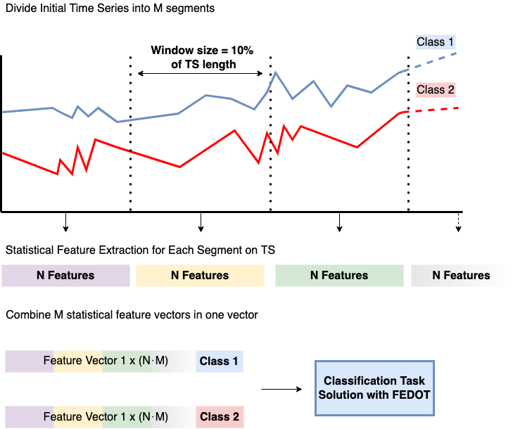
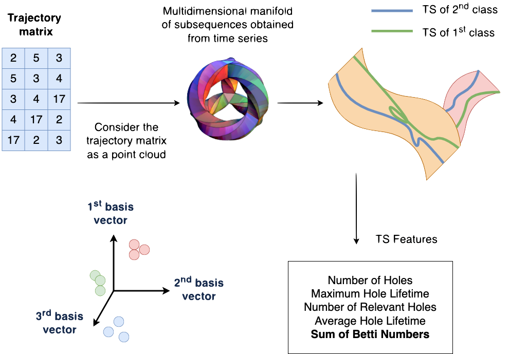

Time series classification
==========================
Time series classification is a problem where a time series is classified into one of a set of classes.
The time series can be of any length and can be univariate or multivariate.
The classes can be of string or integer type.

The classification of time series is the task of constructing a classifier based
on input data presented as a time-ordered data sequence. The mathematical
formulation of the problem can be presented in the following form:

.. math::

    \begin{equation}
      F: X\rightarrow  \mathbb{D}
    \end{equation}

where:

- :math:`X` is a time series of length :math:`t = [x_1, x_2, ..., x_t], x_i \in R`;
- :math:`F` is a trained classifier with some hyperparameters;
- :math:`D= {(X_1, Y_1),...,(X_n, Y_n )}` a collection of a time series :math:`X` paired with labels :math:`Y\in \mathbb{N}`.

The time series classification experiment consists of the following steps:

- First, the time series is transformed into some feature vector.
- The next step is to select a classifier, which is a specific machine-learning
  model. Here we use the evolutionary capabilities of FEDOT Framework.
- The final stage is to obtain a vector (for binary classification problems) or a matrix (for multiclass classification problems) of the probabilities of class labels, which is further transformed into a vector of classes.

Within the framework we use the following feature generators:

Feature generation algorithms
-----------------------------
**1. Quantile feature generator**

:ref:`This method<quantile-extractor-label>` of generating features can be used independently and as part
of another method (described below in the description of the spectral
feature extractor). The idea of the method is straightforward: for each
time series, its feature vector is formed, which includes the values of
statistical features calculated over the length of the entire series.

The statistical features given below are used to form the feature vector of
each time series. If the obtained statistical feature's variance is equal to
or almost zero, then such a feature is removed from the final feature vector.

This method can be modified by using window methods, which may allow tracking
the variability of features over time.

As a feature, we use the following statistical values:

- mean and median values
- standard deviation and dispersion values
- minimum and maximum values
- number of non-zero values, :math:`5%`, :math:`25%`, :math:`75%`, and :math:`95%` quantiles.

**2. Topological feature generator**

Topological Data Analysis (TDA) can broadly be described as a collection
of data analysis methods that find structure in data. It includes:
clustering, manifold estimation, nonlinear dimension reduction, mode
estimation, ridge estimation, and persistent
homology [1]_. For specific time series, for example, related to EEG
data analysis, the use of spectral or other features is ineffective.
The reason is that specific geometric patterns in the series' structure
characterize the series best. Those patterns can be described as a
feature vector using the module proposed in this section.

The main idea of TDA is to use the topological and geometrical properties of
input data, for example, its shape or connectivity, to extract informative
features, which could be used further by other classification algorithms.

Persistent homology is one way to describe such features numerically. It
considers data as a point cloud and tries to detect the presence of holes using
discretization and triangulation of the initial data space with
simplicial complexes.

Several features can be obtained in FEDOT-TSC using a TDA-based generator:

- Number of Holes
- Maximum Hole Lifetime
- Number of Relevant Holes
- Average Hole Lifetime
- Sum of Betti Numbers

.. [1] Wasserman, Larry. "Topological data analysis." Annual Review
        of Statistics and Its Application 5 (2018): 501-532.

.. note::
    The feature generation methods described above can be used independently
    or as part of the feature ensemble approach. The feature ensemble approach
    is a method of combining features from different feature generation methods.

    Is is also possible to use the ML models ensemble approach. The ML models
    ensemble approach is a method of combining predictions from different ML
    models.

    Both of these approaches are described :ref:`on this page<basic-tsc-example>`.
