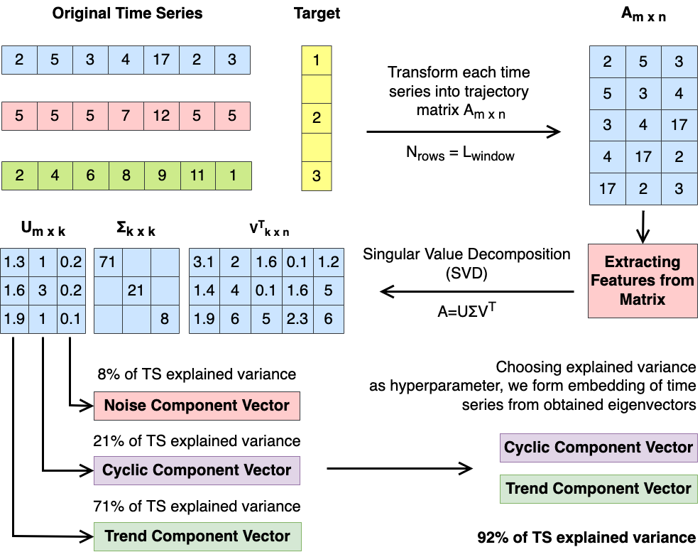
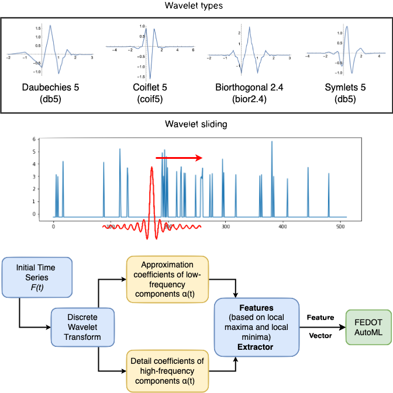

Time series classification
==========================
Time series classification is a problem where a time series is classified into one of a set of classes.
The time series can be of any length and can be univariate or multivariate.
The classes can be of string or integer type.

Feature generation algorithms
-----------------------------
**1. Quantile feature generator**

This method of generating features can be used independently and as part
of another method (described below in the description of the spectral
feature extractor). The idea of the method is straightforward: for each
time series, its feature vector is formed, which includes the values of
statistical features calculated over the length of the entire series.

.. image:: img_basics/quantile-algorithm.png
   :alt: Quantile feature generator
   :width: 500px
   :align: center

**2. Topological feature generator**

Topological Data Analysis (TDA) can broadly be described as a collection
of data analysis methods that find structure in data. It includes:
clustering, manifold estimation, nonlinear dimension reduction, mode
estimation, ridge estimation, and persistent
homology [1]_. For specific time series, for example, related to EEG
data analysis, the use of spectral or other features is ineffective.
The reason is that specific geometric patterns in the series' structure
characterize the series best. Those patterns can be described as a
feature vector using the module proposed in this section.

.. image:: img_basics/topological-algorithm.png
   :alt: Quantile feature generator
   :width: 500px
   :align: center

**3. Spectral feature generator**

For a one-dimensional series, the basic SSA method [2]_ converts the original series
into a trajectory matrix, applies a singular value decomposition (SVD_)
for the resulting matrix, and groups the eigenvectors among themselves.
It is often possible to distinguish some additive components of the
original series, such as the trend (the smooth and slowly changing part of
the series), various oscillatory and periodic components, and the noise
component.

**4. Wavelet feature generator**

This feature generation method for time series is based on the Wavelet
Transform.

Wavelet transformations are time-frequency transformations using
wavelets (mathematical basis functions localized in both time and
frequency). They are similar to Fourier transforms, with the difference
that Fourier transforms are localized only in frequency.

The approach we use to extract features from a frequency-based domain
is supposed to use peaks (local maxima) or troughs (local minima) in
the data obtained after the wavelet transform. As hyperparameters in
this method, we use a threshold value (minimal peak value) according
to which the peak (or trough) should be higher (or lower).

The final feature vector is formed using various combinations of such
features (the number of peaks above a particular value, the distance
between peaks with the same value, and others).

.. _SVD: https://en.wikipedia.org/wiki/Singular_value_decomposition

.. [1] Wasserman, Larry. "Topological data analysis." Annual Review
        of Statistics and Its Application 5 (2018): 501-532.

.. [2] Golyandina, N. (2020). Particularities and commonalities of
        singular spectrum analysis as a method of time series analysis and
        signal processing. Wiley Interdisciplinary Reviews: Computational
        Statistics, 12(4), e1487.
        https://doi.org/10.1002/wics.1487

Feature ensemble approach
-------------------------
The feature ensemble approach is a method of combining features from
different feature generation methods.

ML models enseble approach
--------------------------
The ML models ensemble approach is a method of combining predictions
from different ML models.