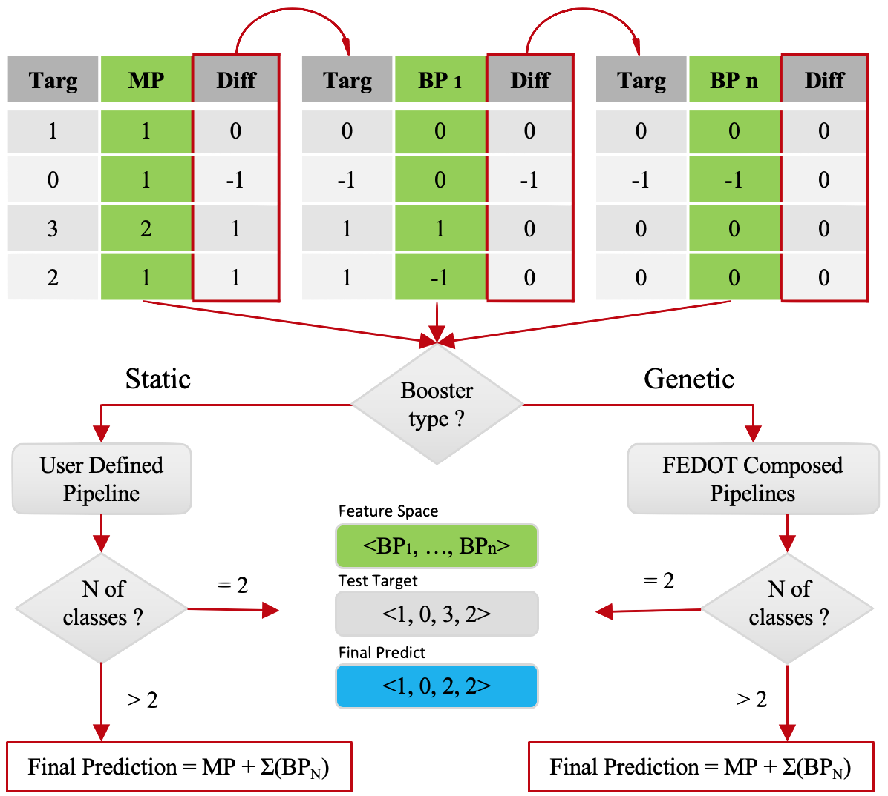

Time series classification
==========================
Time series classification is a problem where a time series is classified into one of a set of classes.
The time series can be of any length and can be univariate or multivariate.
The classes can be of string or integer type.

The classification of time series is the task of constructing a classifier based
on input data presented as a time-ordered data sequence. The mathematical
formulation of the problem can be presented in the following form:

.. math::

    \begin{equation}
      F: X\rightarrow  \mathbb{D}
    \end{equation}

where:

- :math:`X` is a time series of length :math:`t = [x_1, x_2, ..., x_t], x_i \in R`;
- :math:`F` is a trained classifier with some hyperparameters;
- :math:`D= {(X_1, Y_1),...,(X_n, Y_n )}` a collection of a time series :math:`X` paired with labels :math:`Y\in \mathbb{N}`.

The time series classification experiment consists of the following steps:

- First, the time series is transformed into some feature vector.
- The next step is to select a classifier, which is a specific machine-learning
  model. Here we use the evolutionary capabilities of FEDOT Framework.
- The final stage is to obtain a vector (for binary classification problems) or a matrix (for multiclass classification problems) of the probabilities of class labels, which is further transformed into a vector of classes.

Within the framework we use the following feature generators:

Feature generation algorithms
-----------------------------
**1. Quantile feature generator**

This method of generating features can be used independently and as part
of another method (described below in the description of the spectral
feature extractor). The idea of the method is straightforward: for each
time series, its feature vector is formed, which includes the values of
statistical features calculated over the length of the entire series.

.. image:: img_basics/quantile-algorithm.png
   :alt: Quantile feature generator
   :width: 500px
   :align: center

The statistical features given below are used to form the feature vector of
each time series. If the obtained statistical feature's variance is equal to
or almost zero, then such a feature is removed from the final feature vector.

This method can be modified by using window methods, which may allow tracking
the variability of features over time.

As a feature, we use the following statistical values:

- mean and median values
- standard deviation and dispersion values
- minimum and maximum values
- number of non-zero values, :math:`5%`, :math:`25%`, :math:`75%`, and :math:`95%` quantiles.

**2. Topological feature generator**

Topological Data Analysis (TDA) can broadly be described as a collection
of data analysis methods that find structure in data. It includes:
clustering, manifold estimation, nonlinear dimension reduction, mode
estimation, ridge estimation, and persistent
homology [1]_. For specific time series, for example, related to EEG
data analysis, the use of spectral or other features is ineffective.
The reason is that specific geometric patterns in the series' structure
characterize the series best. Those patterns can be described as a
feature vector using the module proposed in this section.

.. image:: img_basics/topological-algorithm.png
   :alt: Quantile feature generator
   :width: 500px
   :align: center

The main idea of TDA is to use the topological and geometrical properties of
input data, for example, its shape or connectivity, to extract informative
features, which could be used further by other classification algorithms.

Persistent homology is one way to describe such features numerically. It
considers data as a point cloud and tries to detect the presence of holes using
discretization and triangulation of the initial data space with
simplicial complexes.

Several features can be obtained in FEDOT-TSC using a TDA-based generator:

- Number of Holes
- Maximum Hole Lifetime
- Number of Relevant Holes
- Average Hole Lifetime
- Sum of Betti Numbers

**3. Spectral feature generator**

For a one-dimensional series, spectral generator is almost the basic SSA
method [2]_.

.. image:: img_basics/spectral-algorithm.png
   :alt: Quantile feature generator
   :width: 500px
   :align: center

- First, it converts the original series into a trajectory matrix.

Let an integer :math:`L` be the
length of the window and at the same time :math:`2\leqslant L\leqslant N/2`.
Thus a window of subsequences is formed :math:`\{f_i, f_{i+1},..., f_{i+L-1}\}`
for :math:`i=0,...,N-L`:

.. math::
        \begin{align*}
        X_0&=(f_0, f_1, f_2, ..., f_{L-1})^T \\
        X_1&=(f_1, f_2, f_3, ..., f_{L})^T \\
        X_2&=(f_2, f_3, f_4, ..., f_{L+1})^T \\
        X_3&=(f_3, f_4, f_5, ..., f_{L+2})^T \\
        &\vdots \\
        X_{N-L}&=(f_{N-L}, f_{N-L+1}, f_{N-L+2}, ..., f_{N-1})^T
        \end{align*}

The above matrix shows that the elements of the antidiagonals (the diagonals
going from bottom left to right) are equal. This type of matrix is known as
the Hankel matrix.

The number of columns in the trajectory matrix is equal to :math:`K=N-L+1`.
We call the columns :math:`X` delay vectors :math:`L`, and the rows delay
vectors :math:`K`.

- Second, It applies a singular value decomposition (SVD_) for the resulting matrix

.. math::
        \begin{equation}
        X = U \Sigma V^T
        \end{equation}

where :math:`U` is a matrix of left singular vectors, :math:`\Sigma` is a
diagonal matrix of singular values, and :math:`V` is a matrix of right singular
vectors.

- Third, It groups the eigenvectors among themselves and eliminate those which
  do not provide sufficient variance of initial data.

It is often possible to distinguish some additive components of the
original series, such as the trend (the smooth and slowly changing part of
the series), various oscillatory and periodic components, and the noise
component.

**4. Wavelet feature generator**

This feature generation method for time series is based on the Wavelet
Transform.

Wavelet transformations are time-frequency transformations using
wavelets (mathematical basis functions localized in both time and
frequency). They are similar to Fourier transforms, with the difference
that Fourier transforms are localized only in frequency.

.. image:: img_basics/wavelet-algorithm.png
   :alt: Wavelet feature generator
   :width: 500px
   :align: center

The approach we use to extract features from a frequency-based domain
is supposed to use peaks (local maxima) or troughs (local minima) in
the data obtained after the wavelet transform. As hyperparameters in
this method, we use a threshold value (minimal peak value) according
to which the peak (or trough) should be higher (or lower).

The final feature vector is formed using various combinations of such
features (the number of peaks above a particular value, the distance
between peaks with the same value, and others).

.. _SVD: https://en.wikipedia.org/wiki/Singular_value_decomposition

.. [1] Wasserman, Larry. "Topological data analysis." Annual Review
        of Statistics and Its Application 5 (2018): 501-532.

.. [2] Golyandina, N. (2020). Particularities and commonalities of
        singular spectrum analysis as a method of time series analysis and
        signal processing. Wiley Interdisciplinary Reviews: Computational
        Statistics, 12(4), e1487.
        https://doi.org/10.1002/wics.1487

Feature ensemble approach
-------------------------
The feature ensemble approach is a method of combining features from
different feature generation methods.

ML models ensemble approach
----------------------------
The ML models ensemble approach is a method of combining predictions
from different ML models.

Error correction
----------------
The essence of the proposed approach is to iteratively perform compositing
with the step of "freezing" the previous model. Each subsequent model is
trained on the previous model error, allowing to obtain the correction of
the initial prediction error.

The error correction model is a regression model where the target for each
subsequent step is the difference between the last target and the
last prediction.

