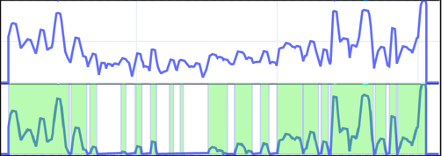
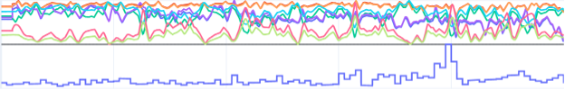

Anomaly detection example
=========================
This example shows how to use the anomaly detection module to detect anomalies
in a time series.

Anomaly detection is one of the most relevant tasks in terms of time series analysis, which finds wide application in various branches of medicine, industry, meteorology, etc.
The listing below shows an example of running an anomaly detection experiment with ThresholdZonesDetector, which breaks one time series into anomalies. This detector takes a percentage value as an argument, denoting the desired percentage duration of the trimmed zones.

.. code-block:: python

    from fedot_ind.core.models.anomaly_detection import FileObject, ThresholdZonesDetector

    file_object = FileObject(time_series, "Name")

    detector = ThresholdZonesDetector(0.5)
    detector.load_data(file_object)
    detector.run_operation()
    file_object = detector.return_new_data()

The figure below shows the result of this detector. The detector divides the time series into separate zones by cutting the values of the series by the boundary, the value of which is determined adaptively, according to a given percentage value.

In the listing below is an example of code for an algorithm based on the AngleBasedDetector, which works with several time series. The detector takes one parameter - the length of the window to analyze. It can be followed by a window step. By default, the step is equal to the window length divided by 4. The result of the work is contained in the test_vector_ts field and represents a separate time series, which is suitable for further processing.

.. code-block:: python

    from fedot_ind.core.models.anomaly_detection import FileObject, AngleBasedDetector

    data_dict = {"time_series_1": time_series_1,
                 "time_series_2": time_series_2}

    file_object = FileObject()
    file_object.time_series_data = data_dict
    detector = AngleBasedDetector(300)
    detector.load_data(file_object)
    detector.run_operation()
    file_object = detector.return_new_data()

The detector converts several time series into one using a window that moves along the time series. Inside each window, the set of rows is split into an array of vectors whose length is equal to the length of the window. Each vector consists of the corresponding values of each time series at a given point.
Then the maximum vector distance between the last vector in the window and the rest of the vectors is found. The result of the detector is shown in the figure below.

