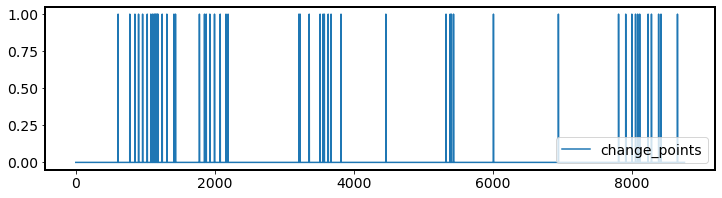
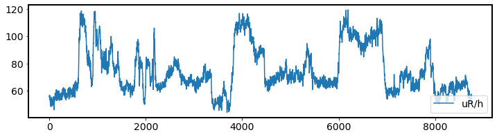
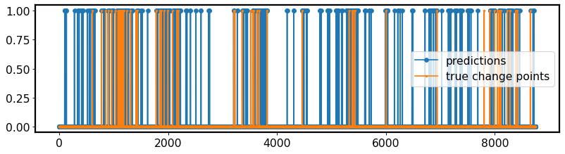

.. _change-point-detection-example:

Change point detection example
==============================

This example shows how to use the change point detection algorithm to detect
changes in the mean of a time series.

For this example you need to download a real well-log dataset for an oil well.

**Workflow for change point detection task**
--------------------------------------------

**1. First we need to import necessary libraries.**
~~~~~~~~~~~~~~~~~~~~~~~~~~~~~~~~~~~~~~~~~~~~~~~~~~~

Setting up sys path for Fedot.Industrial

.. code-block:: python

    import sys
    sys.path.append(r'...\Fedot.Industrial')

Setting up libraries to work with the dataset.

.. code-block:: python

    import requests
    from io import StringIO
    import pandas as pd
    import numpy as np 

Setting up library to work with vizualisation.

.. code-block:: python

    import matplotlib.pyplot as plt

Finally, setting up main modules for change point detection task.

.. code-block:: python

    from core.operation.transformation.WindowSelection import WindowSizeSelection
    from core.models.subspace.SSTdetector import SingularSpectrumTransformation

**2. Data Loading.**
~~~~~~~~~~~~~~~~~~~~

Download the dataset for this experiment.

.. code-block:: python

    def df_expirement():
        url = "https://storage.yandexcloud.net/cloud-files-public/dataframe.csv" 
        df = pd.read_csv(StringIO(requests.get(url).content.decode('utf-8')), sep='|')
        return df
    df = df_expirement()

**3. Some data engineering.**
~~~~~~~~~~~~~~~~~~~~~~~~~~~~~

First, you need to define the oil well we are working with.

.. code-block:: python

    df_columns = df.columns 
    first_label_list = df[df_columns[0]].unique() 
    df_aa564g = df[df[df_columns[0]] == first_label_list[0]]

Define important columns to work with. For this expirement you need to use just 2 columns.
They are **uR/h** - rock radioactive rate and **unitless** - class of rock (from 0 to 5).

.. code-block:: python

    df_aa564g_first = df_aa564g.drop(axis=1, labels=(df_aa564g.columns[0])) \
        .drop(axis=1, labels=(df_aa564g.columns[1]))[['uR/h', 'unitless']].reset_index(drop=True)

Before using the well-log you need to skip empty rows.

.. code-block:: python

    df_edited_ = df_aa564g_first.loc[df_aa564g_first['unitless'] >= 0]\
    .loc[df_aa564g_first['uR/h'] >= 0].reset_index(drop=True)
    df = df_edited_

You need to define real change points in the df. Let`s assume that changing rock type in real-time considered as change points here.

.. code-block:: python

    cp_1 = []
    for i in range(len(df)-1):
        if df['unitless'][i] !=  df['unitless'][i+1]:
            cp_1.append(1)
        else:
            cp_1.append(0)
    df['change_points'] = cp_1 + [0]

**4. Look at ground true change point labels.**
~~~~~~~~~~~~~~~~~~~~~~~~~~~~~~~~~~~~~~~~~~~~~~~

Just to be sure that it was done in a right way.

The right way is to have some change point labels according to time series changes (look at the pictures below for example).

.. code-block:: python

    df.change_points.plot(figsize=(12,3))
    plt.legend()
    plt.show()

**5. Method applying.**
~~~~~~~~~~~~~~~~~~~~~~~
.. note:: 
    Highly recommended to use :ref:`WindowSizeSelection class <Window-Size-Selection>` to choose appropriate :ref:`Singular Spectrum Transformation<SST>` hypeparameters. Moreover, it is recommended to use ``summary_statistics_subsequences`` as the fastest algorithm implementation for window size selection task. Also, it is useful to set up ``dynamic_mode = True`` in SST, because we are working with non stationary time series.

Define your time series and set hypeparameters via :ref:`WindowSizeSelection class <Window-Size-Selection>`. In the end use :ref:`Singular Spectrum Transformation<SST>` to detect change point scores in the time series.

.. code-block:: python

    ts = list(df['uR/h'])

Here is our time series.

Here we are looking best hyperparameters for change point detection model

.. code-block:: python

    ts_window_length = WindowSizeSelection(time_series = ts, wss_algorithm = 'summary_statistics_subsequence').runner_wss()[0]
    trajectory_window_length = WindowSizeSelection(time_series = ts[:ts_window_length], window_max = ts_window_length,  wss_algorithm = 'summary_statistics_subsequence').runner_wss()[0]

Set up SingularSpectrumTransformation. Choose **lag** parameter as you wish to be. However, for this example lag should be about 20, because a drilling pattern repeats every ~ 20 meters.

.. code-block:: python

    scorer = SingularSpectrumTransformation(time_series = np.array(ts),
                                            ts_window_length = ts_window_length,
                                            lag = 20,
                                            trajectory_window_length = trajectory_window_length)
    score = scorer.score_offline(dynamic_mode=True)

Save results to the df.

.. code-block:: python

    df['results'] = score

**6. Results**
~~~~~~~~~~~~~~

.. code-block:: python

    plt.figure(figsize=(12,3), dpi=80)
    df['results'].plot(label='predictions', marker='o', markersize=5)
    df['change_points'].plot(label='true change points', marker='o', markersize=2)
    plt.legend()

**Change point detection example in one code-block**
----------------------------------------------------
.. note::
    Here we skip section №4.

Just take a copy and run in your Jupyter Notebook!

.. code-block:: python

    import sys
    sys.path.append(r'...\Fedot.Industrial')    
    import requests
    from io import StringIO
    import pandas as pd
    import numpy as np 
    import matplotlib.pyplot as plt
    from core.operation.transformation.WindowSelection import WindowSizeSelection
    from core.models.subspace.SSTdetector import SingularSpectrumTransformation

    def df_expirement():
        url = "https://storage.yandexcloud.net/cloud-files-public/dataframe.csv" 
        df = pd.read_csv(StringIO(requests.get(url).content.decode('utf-8')), sep='|')
        return df

    df = df_expirement()
    df_columns = df.columns 
    first_label_list = df[df_columns[0]].unique() 
    df_aa564g = df[df[df_columns[0]] == first_label_list[0]]
    df_aa564g_first = df_aa564g.drop(axis=1, labels=(df_aa564g.columns[0])) \
        .drop(axis=1, labels=(df_aa564g.columns[1]))[['uR/h', 'unitless']].reset_index(drop=True)
    df_edited_ = df_aa564g_first.loc[df_aa564g_first['unitless'] >= 0]\
    .loc[df_aa564g_first['uR/h'] >= 0].reset_index(drop=True)
    df = df_edited_

    cp_1 = []
    for i in range(len(df)-1):
        if df['unitless'][i] !=  df['unitless'][i+1]:
            cp_1.append(1)
        else:
            cp_1.append(0)
    df['change_points'] = cp_1 + [0]

    ts = list(df['uR/h'])

    ts_window_length = WindowSizeSelection(time_series = ts, wss_algorithm = 'summary_statistics_subsequence').runner_wss()[0]
    trajectory_window_length = WindowSizeSelection(time_series = ts[:ts_window_length], window_max = ts_window_length,  wss_algorithm = 'summary_statistics_subsequence').runner_wss()[0]
    scorer = SingularSpectrumTransformation(time_series = np.array(ts),
                                            ts_window_length = ts_window_length,
                                            lag = 20,
                                            trajectory_window_length = trajectory_window_length)
    score = scorer.score_offline(dynamic_mode=True)
    
    df['results'] = score
    plt.figure(figsize=(12,3), dpi=80)
    df['results'].plot(label='predictions', marker='o', markersize=5)
    df['change_points'].plot(label='true change points', marker='o', markersize=2)
    plt.legend()
