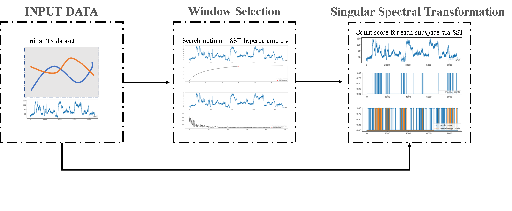

Architecture of FEDOT.Industrial
================================

The FEDOT.Industrial framework is a versatile tool for the time-series
engineer. The software is designed to minimize user involvement in the
programming area while maximizing the quality of the results obtained
for tasks such as: :ref:`time series classification<ts_classification>`,
:ref:`anomaly detection<anomaly>` and :ref:`change point detection<chp_detection>`,
and :ref:`object recognition<object_recognition>`.

.. _`ts_classification`:

Time Series Classification
--------------------------

The classification task for univariate and multivariate time series
arises in many fields of science and technology [1]_, [2]_.
Speech recognition [3]_ and analysis of seismological problems [4]_,
meteorological problems [5]_, medical problems [6]_ and industrial
problems [7]_ can be taken as an example.

We propose the data-driven automated time series classification
approach, which main idea is to combine selection of features in one
feature space and an automated classification model design using a
graph-based pipeline representation and evolutionary optimization.

.. image:: img_introduction/architecture.png
   :width: 700px
   :align: center
   :alt: Architecture of FEDOT

The input data (Input Data block) in the form of
time series goes to the ``Feature Design`` block. The selected features are the
input data for the ``Model Design`` block, where the evolutionary algorithm
(``Evolutionary Optimizer`` block) selects the optimal Pipeline for solving the
classification problem, and, if necessary, an error correction model is
applied. The final pipelines are then applied to obtain predictions, which
are interpreted with application in the corresponding block. To evaluate
the quality of the intermediate results and the final predictions, the
``Quality Analyzer`` block is created, implementing various evaluation metrics.

For the machine learning pipeline creation, represented as an acyclic
graph, we used an approach based on an evolutionary algorithm [8]_.
This pipeline combines multiple methods of feature extraction and
machine learning models. The aim of the evolutionary optimiser is to
obtain the effective but computationally lightweight pipeline avoiding
over-complicated solutions.

It could be used by specialists without machine learning or data
science experience for application tasks in their professional domain,
where the primary data type is time series.

.. _`anomaly`:

Anomaly Detection
-----------------

Anomaly detection is a process of identifying unusual patterns that do
not conform to expected behavior, called outliers. It is also known as
outlier analysis, outlier mining, anomaly analysis, anomaly mining,
anomaly detection, and anomaly diagnosis. Anomaly detection is a
challenging problem in data mining, as it is often difficult to
distinguish between real anomalies and normal data. Anomaly detection
is a common problem in many fields, such as network intrusion detection,
fault detection, fraud detection, and healthcare.

.. _`chp_detection`:

Change Point Detection
----------------------

Change point detection is a statistical method for finding abrupt
changes in the mean of a time series. It is used in many fields, such
as signal processing [9]_, statistics [10]_, and machine learning [11]_. The change point
detection problem is a challenging problem in data mining, as it is often difficult to distinguish between real changes and normal data.

The input data (Input Data block) in the form of time series goes to the ``Window Selections`` block [12]_. At this block user has to chose appropriate algorithm or use default algorithm settings.
Next, selected features and input data are going to ``Singular Spectrum Transformation`` block where where we solving change point detection problem and get a list of binarized change points.

The results could be used by specialists without machine learning or data
science experience for application tasks in their professional domain,
where the primary data type is time series.

.. _`object_recognition`:

Object Detection
----------------

Object detection is a computer technology related to computer vision
and image processing that deals with detecting instances of semantic
objects of a certain class (such as humans, buildings or cars) in
digital images and videos.

.. [1] Schäfer, Patrick, and Ulf Leser. "Fast and accurate time series
        classification with weasel." Proceedings of the 2017 ACM on
        Conference on Information and Knowledge Management. 2017.
.. [2] Ismail Fawaz, Hassan, et al. "Deep learning for time series
        classification: a review." Data mining and knowledge discovery
        33.4 (2019): 917-963.
.. [3] Faouzi, Johann. "Time Series Classification: A review of
        Algorithms and Implementations." Machine Learning (Emerging
        Trends and Applications) (2022).
.. [4] Arul, Monica, and Ahsan Kareem. "Applications of shapelet
        transform to time series classification of earthquake, wind
        and wave data." Engineering Structures 228 (2021): 111564.
.. [5] Bhardwaj, Rashmi, and Varsha Duhoon. "Study and Analysis of
        Time Series of Weather Data of Classification and Clustering
        Techniques." International Conference on Innovative Computing
        and Communications. Springer, Singapore, 2021.
.. [6] Lin, Lei, et al. "Medical Time Series Classification with
        Hierarchical Attention-based Temporal Convolutional Networks:
        A Case Study of Myotonic Dystrophy Diagnosis." CVPR workshops.
        2019.
.. [7] Blázquez-García, Ane, et al. "Water leak detection using
        self-supervised time series classification." Information
        Sciences 574 (2021): 528-541.

.. [8] Nikitin, Nikolay O., et al. "Automated evolutionary approach
        for the design of composite machine learning pipelines."
        Future Generation Computer Systems 127 (2022): 109-125.

.. [9] Tsuyoshi Ide, Koji Tsuda, "Change-Point Detection using Krylov Subspace Learning",
       SIAM International Conference on Data Mining, pp.515-520, 2007

.. [10] A. Artemov and E. Burnaev, "Detecting performance degradation of software-intensive systems in the presence of trends and long-range dependence",
        Proc. IEEE 16th Int. Conf. Data Mining Workshops, pp. 29-36, Dec. 2016.

.. [11] E. Romanenkova et al., "Real-Time Data-Driven Detection of the Rock-Type Alteration During a Directional Drilling," 
        in IEEE Geoscience and Remote Sensing Letters, vol. 17, no. 11, pp. 1861-1865, Nov. 2020, doi: 10.1109/LGRS.2019.2959845.

.. [12] Ermshaus, Arik, Patrick Schäfer, and Ulf Leser. "Window Size Selection In Unsupervised Time Series Analytics: A Review and Benchmark.", 2022