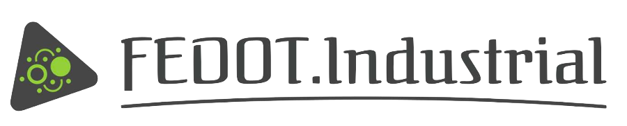

Introduction to Framework
=========================

.. toctree::
    :maxdepth: 1
    :caption: Content:

    installation
    quickstart
    architecture
    license

FEDOT.Industrial is a Python-based open-source framework for automated machine learning.
It is designed to solve complex real-world problems with a minimum of human
intervention. Among this problems are:

**Time series classification**

Here we use a combination of feature generators and light-weight machine learning
models to obtain results which are comparable to the state-of-the-art
approaches.

**Anomaly detection**

.. note::
    This functionality is under development.

**Object detection**

**Object classification**
